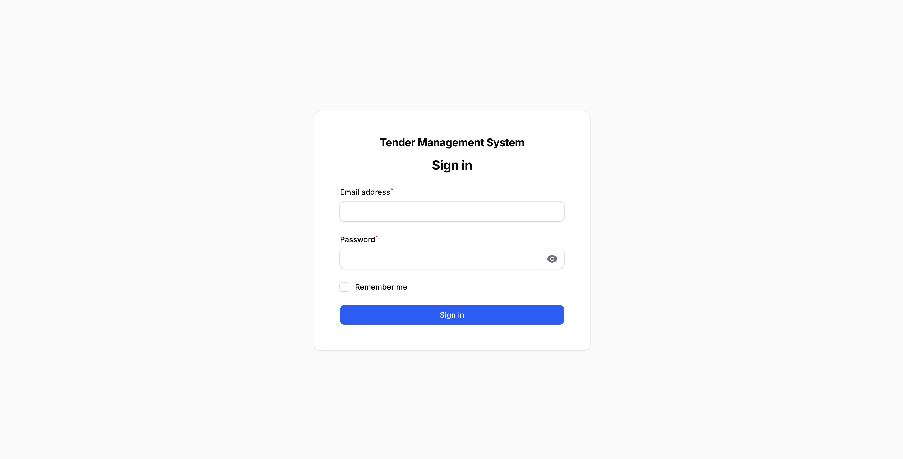
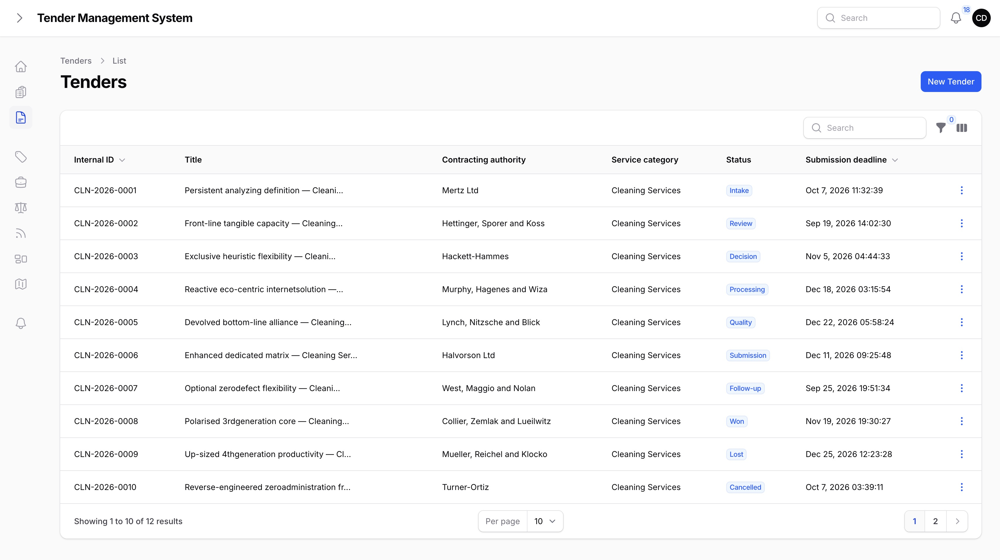
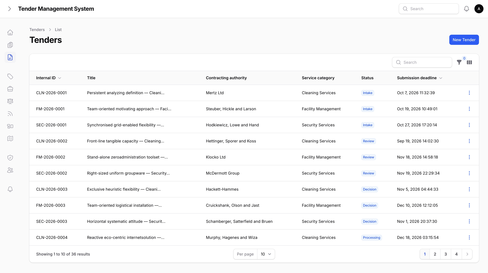

# Getting Started

## Logging in

TMS doesn't have a public sign-up form. An administrator creates your account and gives you a role. Once your account exists, you log in with your email and password at your organization's TMS address.

*The TMS login screen.*

If you don't have an account yet, ask your administrator to create one for you.

## Roles

Your role decides what you can navigate to and manage in TMS. Every user has exactly one role:

| Role | Purpose |
| --- | --- |
| **Super admin** | Full access across the whole system, including user administration and every service category. |
| **Department head** | Oversees a department's tenders and teams, including team assignment. |
| **Team lead** | Leads a team on individual tenders. Assigns owners and team members, and manages tasks. |
| **Calculation** | Works on the pricing/calculation side of a tender. |
| **Concept writer** | Works on the written concept/proposal content of a tender. |
| **Documentation** | Handles supporting documents and evidence for a tender. |
| **Quality control** | Reviews and checks work before it's submitted. |
| **Staff** | General team member working on assigned tasks. |
| **Viewer** | Read-only access, for people who need visibility without making changes. |

*The Roles & Permissions admin page, showing each role's rights.*

Separately from roles, an administrator can also grant individual **rights** to a specific user. For example, the right to see prices or margins on a tender. Rights are additive, so even without a role that normally includes them, a user can be given a right directly. Rights are enforced everywhere in the system, not just hidden in the interface.

## Category scoping

Every tender belongs to exactly one service category, such as a specific line of business your organization bids in. Most users are assigned to one category and only see tenders, tasks, and data within it.

Management-level roles (department head, team lead, super admin) can be set to span all categories instead of just one, giving them a full view across the organization. If a page or list looks smaller than you expect, it's usually because your account is scoped to a single category.

*Tender list as a category-scoped user, only that user's service category is visible.*

*Tender list as a management user, tenders from every service category are visible.*

## Where to go next

- [Managing tenders](03-managing-tenders.md), covering creating a tender and moving it through its lifecycle.
- [Team assignment](04-team-assignment.md), covering assigning an owner and team members to a tender.
