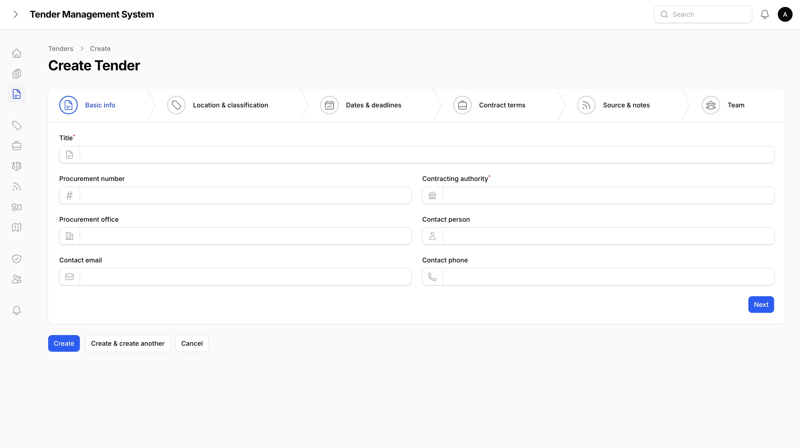
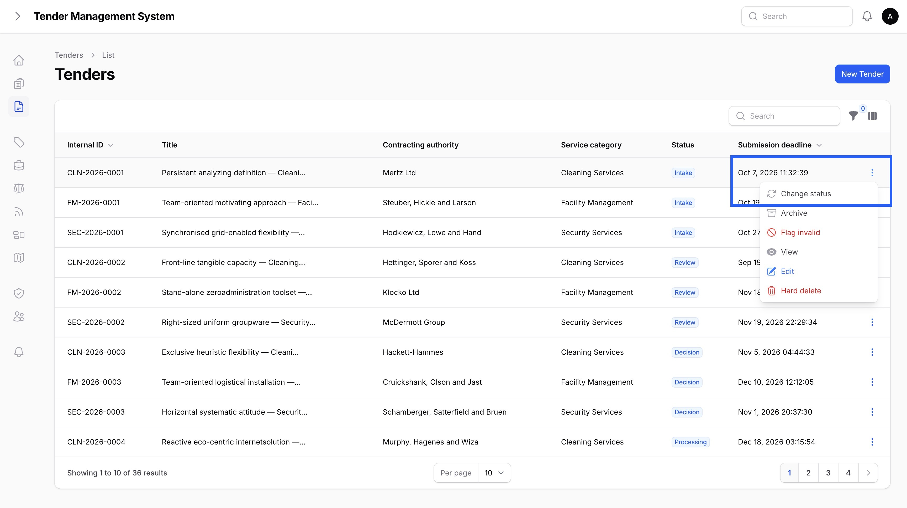
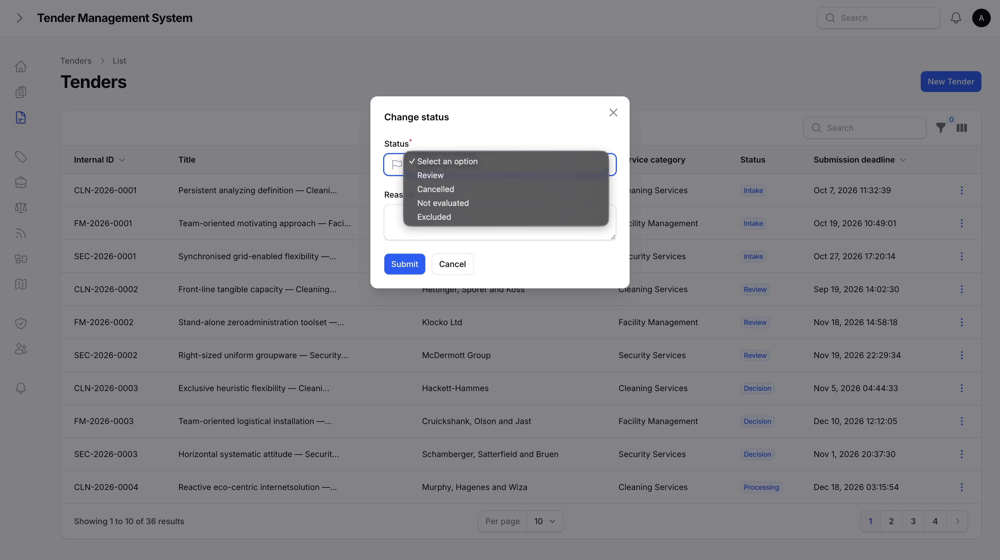
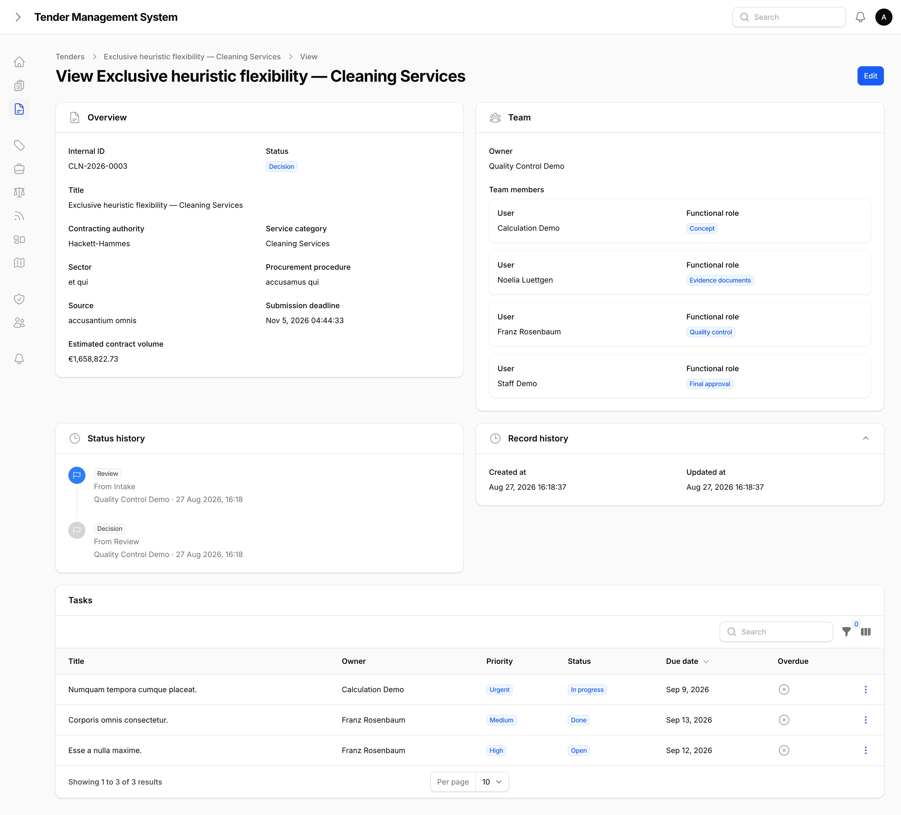
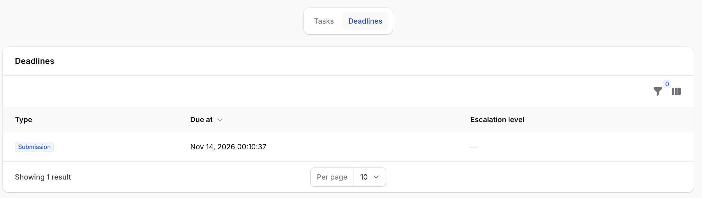
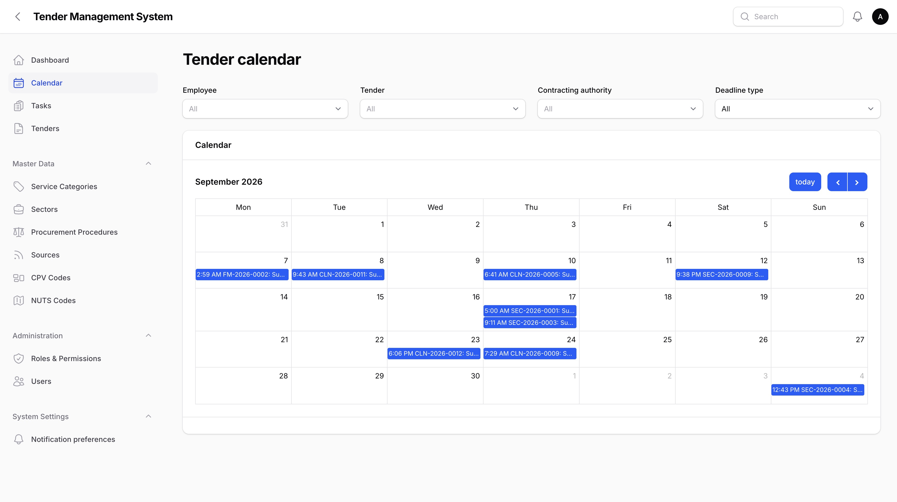
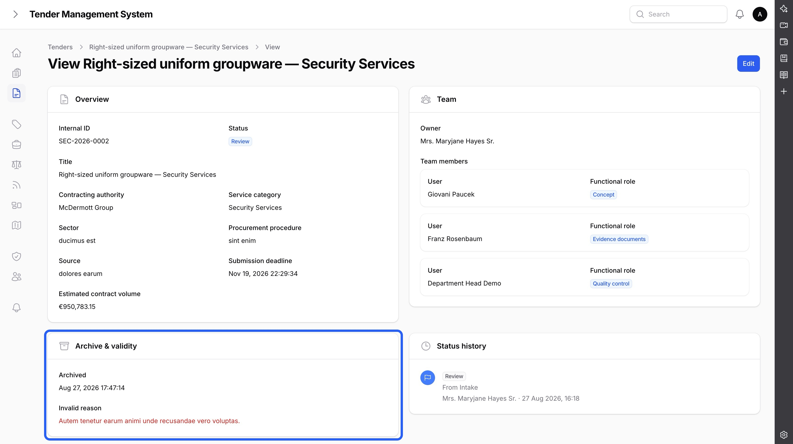

# Managing Tenders

_Last updated: 03/09/2026_

## Creating a tender

A tender is created through a guided, multi-step form. You can move between steps freely while filling it in, but every required field is checked when you save. The steps are:

1. **Basic info.** The tender's title, procurement number, contracting authority, procurement office, and contact details.
2. **Location & classification.** The service category the tender belongs to, its sector, procurement procedure, city, and its CPV and NUTS classification codes.
3. **Dates & deadlines.** The submission deadline, the bidder-question deadline, a site visit date, the publication date, and the bid validity period. These are the three most common deadlines; a tender can carry many more, covered below in [Deadlines, the calendar & escalation](#deadlines-the-calendar--escalation).
4. **Contract terms.** The estimated contract volume, contract term, contract start and end dates, and any extension options.
5. **Source & notes.** Where the tender was found, a link to the source portal, and free-text notes.

*Creating a new tender.*

The estimated contract volume is only visible if your account has the right to see prices. If you don't have that right, the field is hidden entirely rather than shown blank, and your organization's administrator can grant it if you need it.

The wizard has one more step after these five, called **Team**, where you assign an owner and team members to the tender. That step is covered in [Team assignment](04-team-assignment.md).

The contracting authority can also be linked to a structured **Client** record, an optional field next to the required free-text contracting authority. See [Competitors, Market Intelligence, Client History & Pipeline](15-competitors-market-intelligence.md) for what that link is used for.

## The tender lifecycle

Once created, a tender moves through a fixed sequence of stages:

**intake → review → decision → processing → quality → submission → follow-up**

ending in one of: **won, lost, cancelled, not evaluated,** or **excluded**.

A tender can only move to the next stage in the sequence. It can't skip a stage, and it can't move backward. The cancelled, not evaluated, and excluded outcomes are the exception: they can be reached from any active stage, since a tender can be dropped at any point. Won and lost can only be reached from the submission or follow-up stages, since a bid has to actually be submitted first.

To move a tender forward, open it from the tender list and use the **Change status** action. Choose the next stage from the list of stages currently allowed, and optionally add a reason.

*The Change status action, on a tender's row menu.*

*Choosing the next stage and adding a reason.*

Every status change is recorded: who made it, when, what it changed from and to, and the reason if one was given. You can review this history on the tender's detail page, under **Status history**.

Reaching the **submission** stage also locks every document already in the tender's document library at that moment, covered in [Tender Documents](09-tender-documents.md).

### Final submission is gated on the calculation approval chain

A tender can't move from **quality** to **submission** until its current calculation has gone through all 6 steps of its approval chain. This stops a bid from being marked ready to submit while its pricing hasn't been checked, reviewed, and formally signed off. If the chain isn't complete yet, **submission** simply won't appear in the list of next stages. See [Calculations & Approvals](10-calculations-approvals.md) for the full chain and who approves each step.

*A tender's detail page, including its status history.*

## Deadlines, the calendar & escalation

Beyond the submission deadline, bidder-question deadline, and site visit date set in the create wizard, a tender can carry any number of other deadlines: internal calculation, concept, document check, approval, quality check, upload, document requests, presentation, negotiation, and expected decision. Manage them from the **Deadlines** tab on a tender's detail page: add a deadline by picking its type and due date, and edit or remove one later the same way.

*The Deadlines tab, listing a tender's scheduled deadlines.*

Adding, editing, and removing deadlines is restricted to the tender's team lead, department head, or a super admin — the same people who manage the tender's team. Everyone else who can see the tender can still view its deadlines.

One deadline type, **bid validity**, is calculated automatically from the submission deadline plus the bid validity period you set in the create wizard, and can't be edited directly — it updates whenever either of those two inputs changes.

If the tender's owner has a recorded absence covering a deadline's due date, an inline warning appears when setting it. This is only a warning and doesn't block saving the deadline, described further in [People, Teams & Cover](16-people-teams-cover.md#absences--cover).

### The tender calendar

Every deadline across every tender you can see also appears on the **Tender calendar**, reachable from the main navigation, alongside every recorded employee absence, described in [People, Teams & Cover](16-people-teams-cover.md#absences--cover), so upcoming deadlines and upcoming time off can be checked side by side. It shows only tenders within your own category scope, same as everywhere else in the system. Use the filters at the top to narrow the calendar down to a specific employee, tender, contracting authority, or deadline type. Clicking a deadline event takes you straight to that tender's detail page; clicking an absence event takes you to that absence's edit page.

*The tender calendar with its employee, tender, contracting authority, and deadline type filters.*

### Automatic escalation

If a task or a submission deadline is at risk of being missed, the system escalates it automatically, no action needed to trigger it:

- An overdue task first notifies its **owner**. If it's still open 24 hours later, its **tender's owner** is notified too.
- As a submission deadline approaches, if the tender still has an urgent-priority task open, **administrators** are notified once 48 hours remain, and a **management** alert follows once only 24 hours remain.

If the task owner or tender owner being notified is currently on a recorded absence with a cover assigned, the cover is notified as well, alongside the original recipient, described further in [People, Teams & Cover](16-people-teams-cover.md#escalation-and-cover).

Each of these notifications only fires once per task or tender, so you won't be notified repeatedly for the same overdue item. Escalation notifications appear in the notification centre like any other, and follow the same email preferences described in [Notifications](07-notifications.md).

## Archiving and invalidating

Tenders are never deleted outright. If a tender is no longer active or relevant, it's archived instead, and archiving keeps the full record intact. A tender can be archived at any point in its lifecycle, including after it's already been won or lost, since archiving is separate from the status flow above.

Use the **Archive** action on a tender to archive it, and **Unarchive** to bring it back.

If a tender turns out to be invalid, for example a duplicate or a listing that was withdrawn, it can be flagged as invalid instead. Flagging a tender invalid requires a reason, and the flag can be cleared later with **Clear invalid flag** if it turns out the tender is valid after all.

*Archive and validity status on a tender's detail page.*

## Removing a genuine junk entry

In rare cases, such as a tender created by mistake with no real data attached to it, an administrator can permanently remove it. This is a separate, logged action available only to super admins, and it always requires a reason. It's meant for cleaning up genuine mistakes, not for tenders that are simply no longer active, which should be archived instead. See [Administration](08-administration.md) for more on admin-only actions.

## Where to go next

- [Team assignment](04-team-assignment.md), covering assigning an owner and team members to a tender.
- [Tasks](05-tasks.md), covering breaking a tender's work into tracked, assignable tasks.
- [Tender Documents](09-tender-documents.md), covering each tender's versioned document library.
- [Calculations & Approvals](10-calculations-approvals.md), covering pricing calculations and the 6-step approval chain that gates final submission.
- [Bid / No-Bid Decision](11-bid-no-bid-decision.md), covering the participation score and recording a decision to pursue a tender or not.
- [References, Certificates & Concept Library](12-references-certificates-concepts.md), covering the tender's Reference Library tab, where company-wide references, certificates, and concept blocks are linked to a specific bid.
- [Communication, Site Visits, Submission & Follow-up](13-communication-site-visits-submission.md), covering the tender's communication log, site visits, submission record, follow-up tracking, and document requests.
- [Result & Lessons Learned](14-result-lessons-learned.md), covering recording the outcome and a retrospective once a tender reaches one of its terminal statuses.
- [Competitors, Market Intelligence, Client History & Pipeline](15-competitors-market-intelligence.md), covering the optional client link, recording competitors seen on a tender, and the market/pipeline reporting pages.
- [People, Teams & Cover](16-people-teams-cover.md), covering the absences that appear alongside deadlines on the tender calendar and the cover-notification behavior on escalation.
