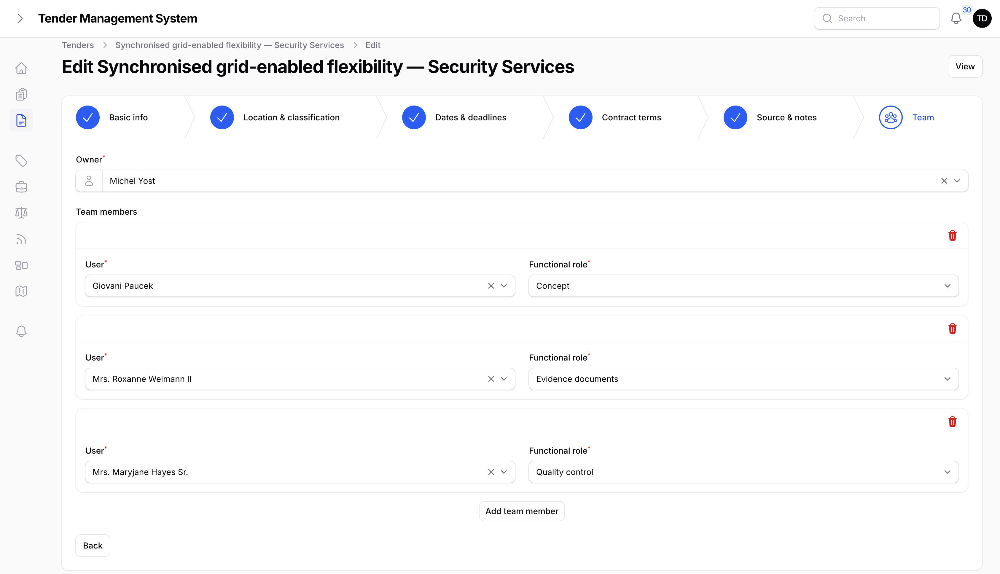

# Team Assignment

## Who can assign a team

Every tender needs an owner, and can have any number of team members covering specific functions. Assigning them is done on the **Team** step of the tender form.

Only team leads, department heads, and super admins can set or change the owner and team members. All three see the same editable step; none has more access here than the others. If you don't hold one of those roles, the Team step is still visible on a tender, but it's read-only. You can see who's assigned without being able to change it.

*The Team step, editable by a team lead, department head, or super admin.*

## The owner

The owner is the one person responsible for the tender overall. Every tender has exactly one. When a tender is first created, the owner defaults to whoever created it, but a team lead, department head, or super admin can reassign it to someone else at any time.

## Team members and functional roles

Beyond the owner, any number of people can be added to a tender's team, each covering one or more functional roles:

| Functional role | Covers |
| --- | --- |
| **Calculation** | Pricing and cost calculation for the bid. |
| **Concept** | Writing the concept or proposal content. |
| **Evidence documents** | Gathering and preparing supporting documents and evidence. |
| **Quality control** | Reviewing and checking the bid before it goes out. |
| **Final approval** | Giving final sign-off before submission. |

A person can be added more than once with different functional roles if they're covering more than one function on a given tender, and more than one person can share the same functional role. The screenshot above shows the owner field alongside a few team members with different functional roles set.

## Where to go next

- [Tasks](05-tasks.md), covering breaking a tender's work into tracked, assignable tasks.
- [Collaboration](06-collaboration.md), covering comments and attachments on tasks.
