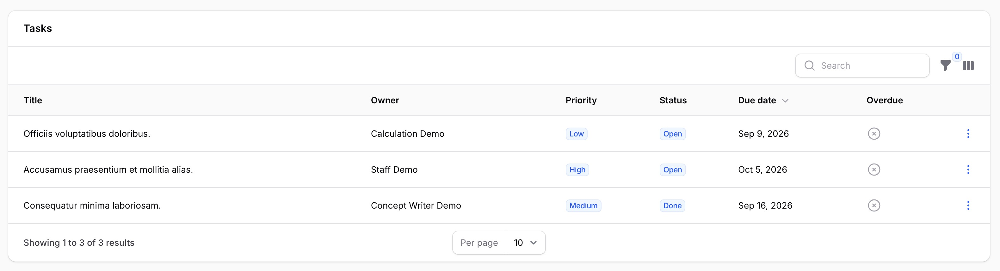
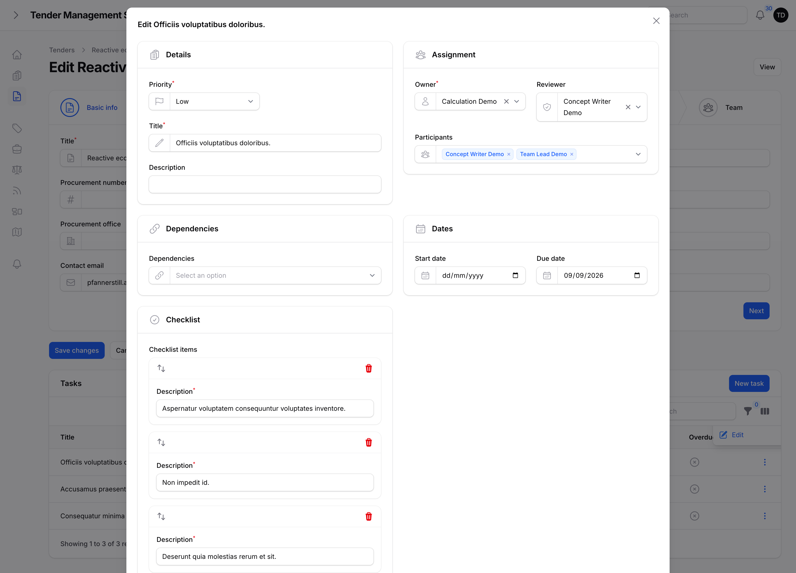
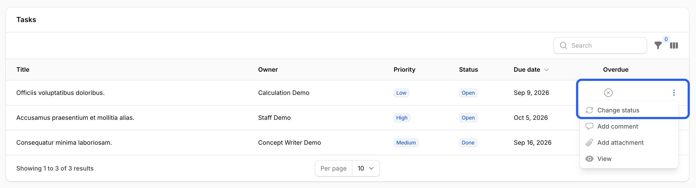
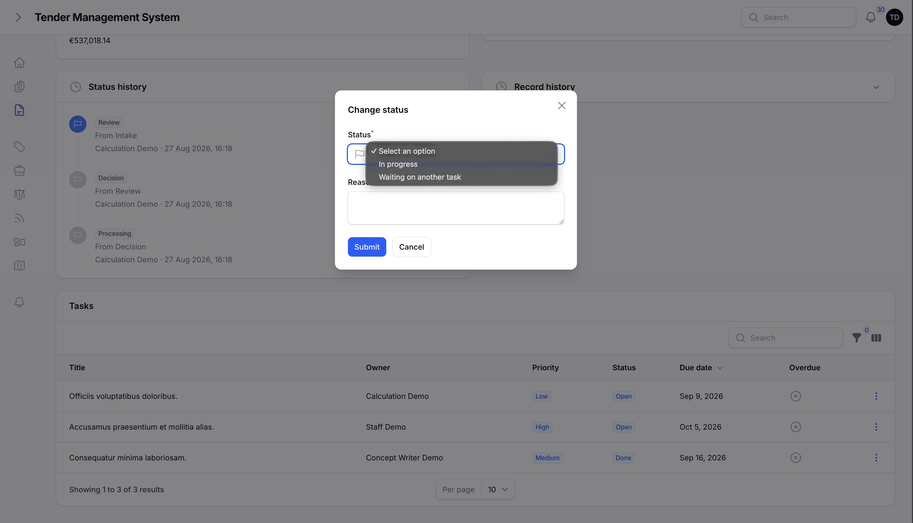
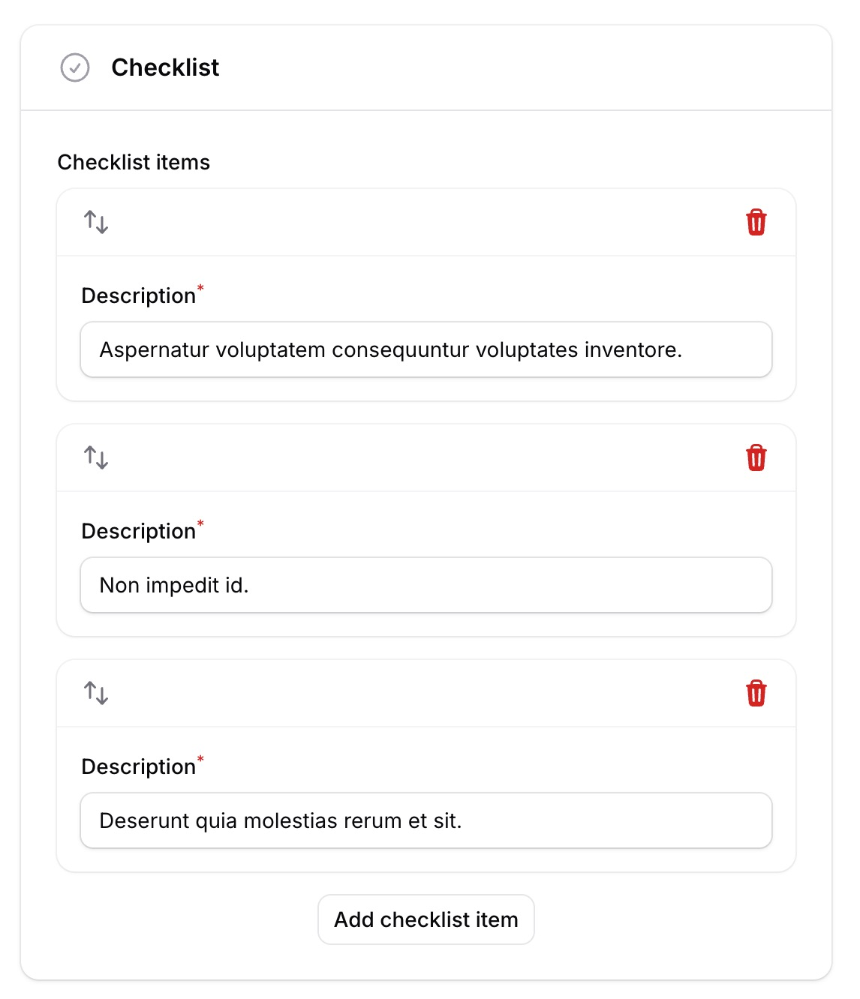
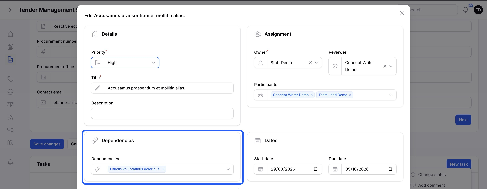

# Tasks

## Breaking a tender down into work

A tender's work is tracked as a set of tasks. Each task has a title, a description, a priority, a due date, a checklist, and its own status. Tasks can be created and managed from a tender's Tasks tab, or from the main task list.

*A tender's task list.*

Priority is one of **low**, **medium**, **high**, or **urgent**, and is set by whoever creates or manages the task.

## Who's involved in a task

A task can involve several people, each with a different role:

| Role | Meaning |
| --- | --- |
| **Creator** | Whoever created the task. Recorded automatically and never changes. |
| **Owner** | The person responsible for getting the task done. |
| **Reviewer** | The person who reviews the task's work before it's marked done, if a review step is needed. |
| **Participants** | Anyone else contributing to the task, beyond the owner. |

Setting or changing the owner, reviewer, and participants is restricted to team leads, department heads, and super admins, the same group that manages team assignment. Everyone else sees these fields read-only.

*Assigning a task's owner, reviewer, and participants.*

## Task status

A task moves through a chain of statuses as work progresses:

**open → in progress → in review → done**

Two additional statuses branch off this chain. A task can be marked **waiting on another task** whenever it's blocked, whether by a dependency or something else, and moved back to in progress once work can continue. And if a review finds a problem, the task goes to **correction required** and returns to in progress once it's fixed, rather than being able to move straight to done. Only the task's owner, reviewer, or a task manager can change its status.

*The Change status action, on a task's row menu.*

*Choosing a task's next status.*

A task that's past its due date and not yet done is shown as **overdue**. This isn't a status you set yourself, it's simply calculated from the due date and current status, and it's shown as a visual flag wherever the task appears.

## Checklists

Each task can have its own checklist of smaller items to track within it, useful for breaking a task down further without creating separate tasks for every small step.

*A task's checklist.*

## Dependencies

A task can depend on one or more other tasks in the same tender. A task with unfinished dependencies can't be marked done until all of them are done first, and the system enforces this even if someone tries to force the status change. This is useful for work that genuinely can't start, or can't be considered finished, until something else is complete.

*Setting a task's dependencies.*

## Where to go next

- [Collaboration](06-collaboration.md), covering comments and attachments on tasks.
- [Notifications](07-notifications.md), covering the notification centre and email preferences.
