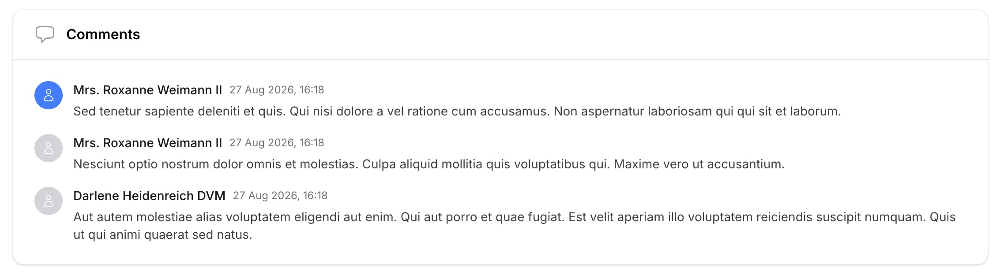
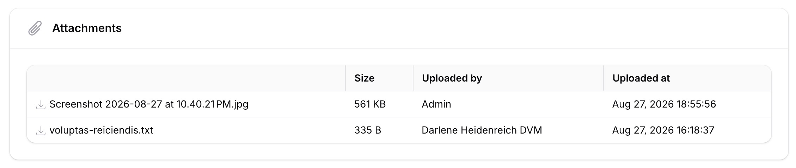
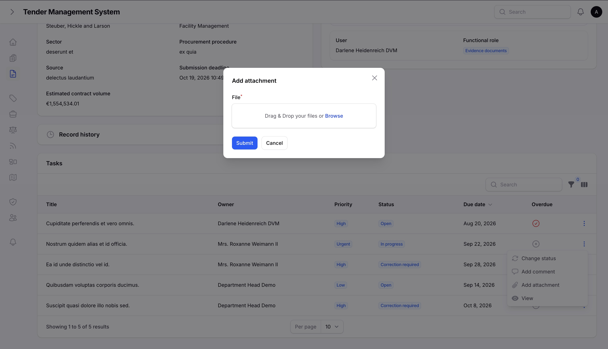
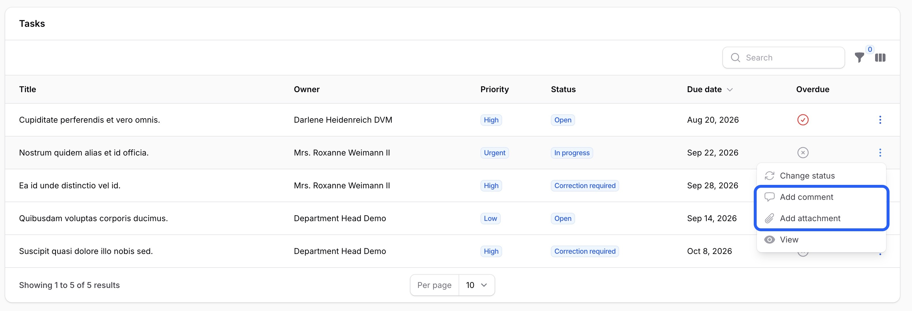

# Collaboration

## Who can comment and attach files

Comments and file attachments are both available on individual tasks, and both use the same rule for who can add them: anyone "linked" to the task, plus anyone who can manage tasks generally.

You're linked to a task if you're its owner, its creator, its reviewer, or one of its participants. Team leads, department heads, and super admins can add comments and attachments to any task, whether they're linked to it or not.

## Comments

Comments let a task's people leave notes for each other without leaving the task. Each comment shows who wrote it and when.

*A task's comment timeline.*

A comment can't be edited once posted. It can only be deleted, and only by whoever wrote it or by a task manager. This keeps the timeline an honest record of what was actually said and when, rather than something that can be quietly rewritten later.

## Attachments

Attachments let you attach files, such as evidence documents or supporting material, directly to the task they belong to, rather than storing them somewhere separate and having to link back to them.

*A task's attachments.*

*Uploading a new attachment.*

Files aren't shown inline. Downloading one uses a dedicated download link that checks you have access to the task it belongs to, the same category-based access rules described in [Getting started](02-getting-started.md), before serving the file.

An attachment can be removed by whoever uploaded it or by a task manager.

## Adding a comment or attachment from the task list

You don't need to open a task to add a comment or attachment to it. Both actions are also available directly from any task list, using the same access rules described above.

*Adding a comment or attachment from the task list, without opening the task.*

## Where to go next

- [Notifications](07-notifications.md), covering the notification centre and email preferences.
- [Administration](08-administration.md), covering user management, roles & rights, and lookup tables.
