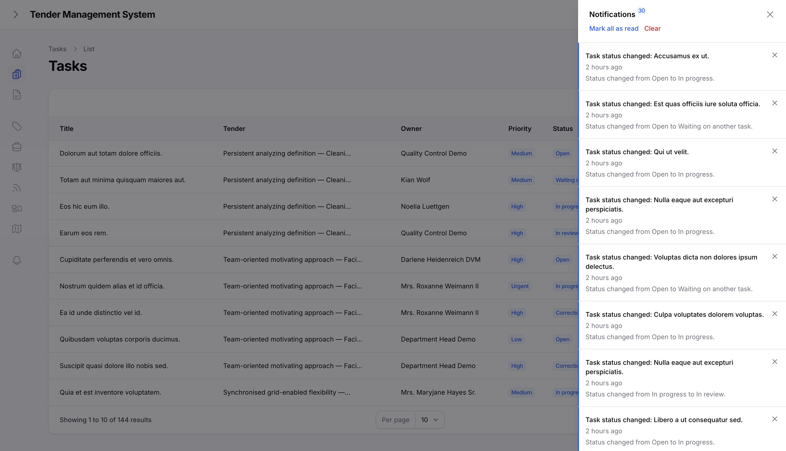
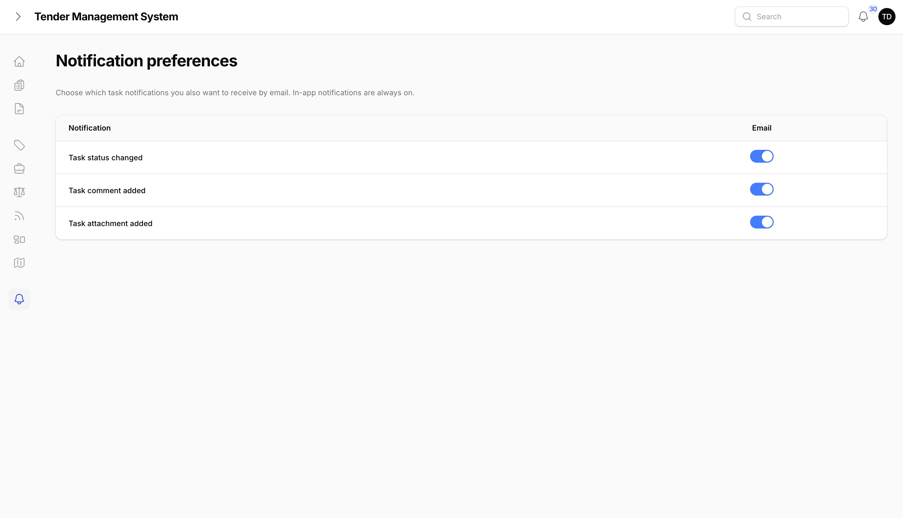

# Notifications

## The notification centre

TMS keeps you informed about activity on the tasks you're involved in through a notification bell in the panel. Opening it shows a running list of what's happened, most recent first.

*The notification bell and its notification list.*

## What triggers a notification

Three kinds of activity generate a notification:

- **A task's status changes.**
- **A comment is added to a task.**
- **A file is attached to a task.**

You're notified about a task if you're linked to it, meaning you're its owner, its creator, its reviewer, or one of its participants. Whoever caused the notification, such as the person who posted the comment, doesn't get notified about their own action.

## Email notifications

In-app notifications are always on. Whether you also get an email for a given notification type is up to you.

Each user manages their own email preferences from the Notification preferences page, with one toggle per notification type. Email is on by default for every type until you turn it off.

*Managing your email notification preferences.*

## Where to go next

- [Administration](08-administration.md), covering user management, roles & rights, and lookup tables.
