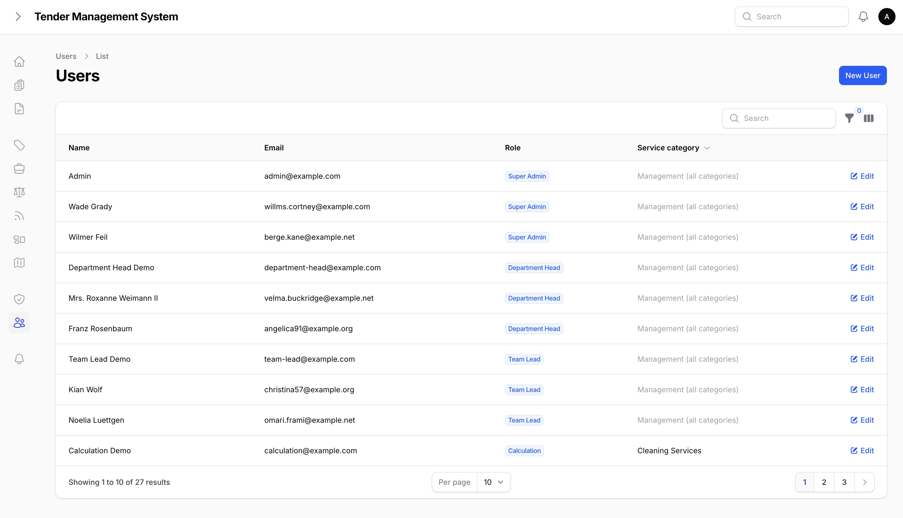
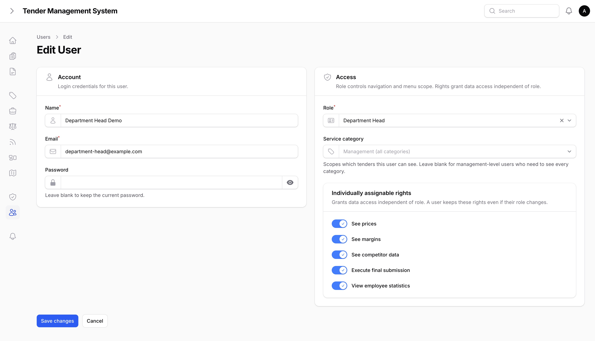
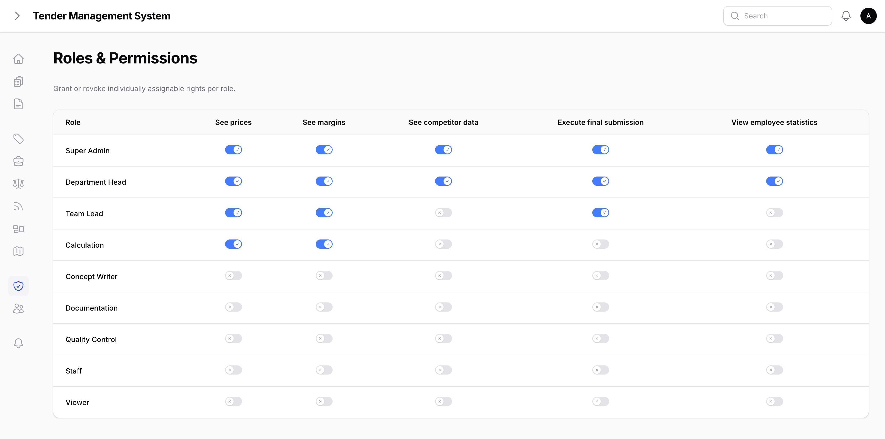
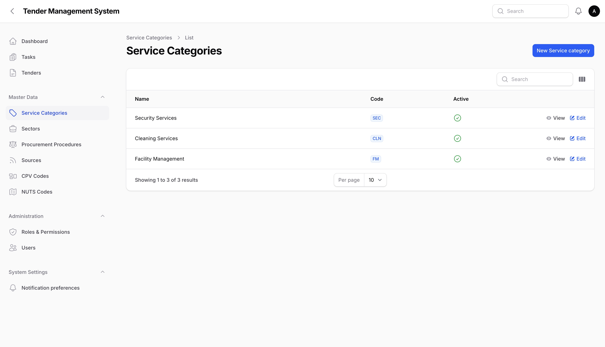
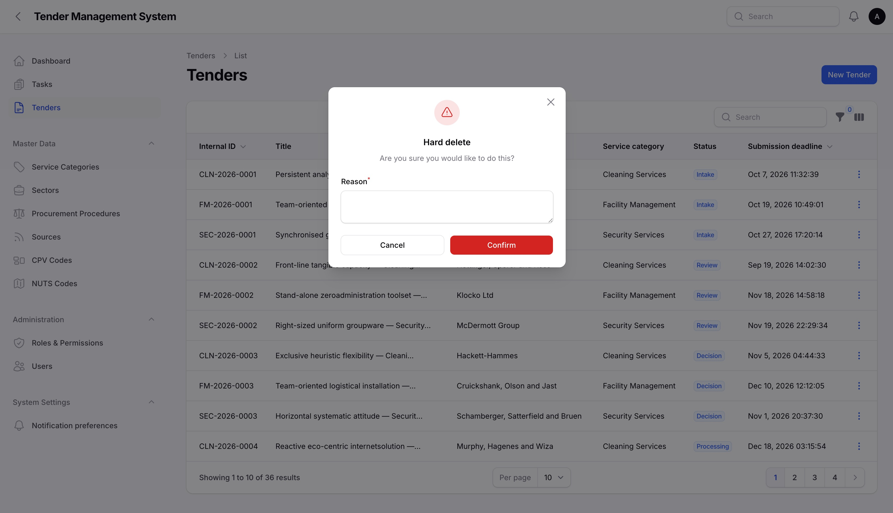

# Administration

_Last updated: 29/08/2026_

This page covers the parts of TMS reserved for administrators: managing user accounts, adjusting roles and rights, maintaining the reference data the rest of the system runs on, and removing genuine junk entries.

## User administration

Only super admins can create or edit user accounts. There's no self-signup and no delete option, since every user is tied into the system's history, such as being an attachment's uploader or a comment's author, so removing a user outright would break that history. If someone leaves, change their role instead of trying to remove them.

*The user list.*

Creating or editing a user is a single form in two sections:

- **Account.** Name, email, and password. Leaving the password blank on an edit keeps the user's current password unchanged.
- **Access.** The user's role, their service category (or none, for a management-level account that spans every category), and any individual rights granted directly to them, on top of whatever their role already includes.

*Creating or editing a user.*

The system won't let you demote the only remaining super admin. If you try to change the last super admin's role to something else, the change is rejected with a warning, whether they're demoting themselves or another admin is doing it. This is a safeguard against ending up with no one able to administer the system.

## Roles and rights

The full role and rights matrix, covering which role has which rights by default, is managed from its own page.

*The roles and rights matrix.*

## Reference data

Several classification lists feed the dropdowns used elsewhere in TMS, such as when creating a tender. They're all admin-managed, and none of them can be deleted outright, only deactivated, so a code or entry already used on an existing tender never disappears from that tender's history.

| Table | Used for |
| --- | --- |
| **Service categories** | The line-of-business categories tenders and users are scoped to, described in [Getting started](02-getting-started.md). |
| **Sources** | Where a tender was found, such as a specific tender portal or a direct enquiry. |
| **Sectors** | The industry sector a tender falls under. |
| **Procurement procedures** | The formal procurement procedure type used for a tender. |
| **CPV codes** | The EU's standard classification codes for the subject of a contract. |
| **NUTS codes** | The EU's standard geographic classification codes, structured as a country/state/region/district hierarchy. |

*Managing a reference data list.*

A service category also carries its own calculation setup: which pricing model it uses, and the specific cost-driver fields a calculation for that category asks for. See [Calculations & Approvals](10-calculations-approvals.md) for how that's configured and how it's used.

## Removing a genuine junk entry

Tenders are never deleted through the normal edit flow, as covered in [Managing tenders](03-managing-tenders.md). For the rare case of a genuine mistake, such as a duplicate created by accident with no real activity on it, a super admin can permanently remove it through a separate, logged action that always requires a reason.

*Permanently removing a junk tender entry.*

This is reserved for true mistakes. A tender that's simply no longer active should be archived instead, not removed.

## Where to go next

- [Tender Documents](09-tender-documents.md), covering each tender's own versioned document library, separate from the reference data covered above.
