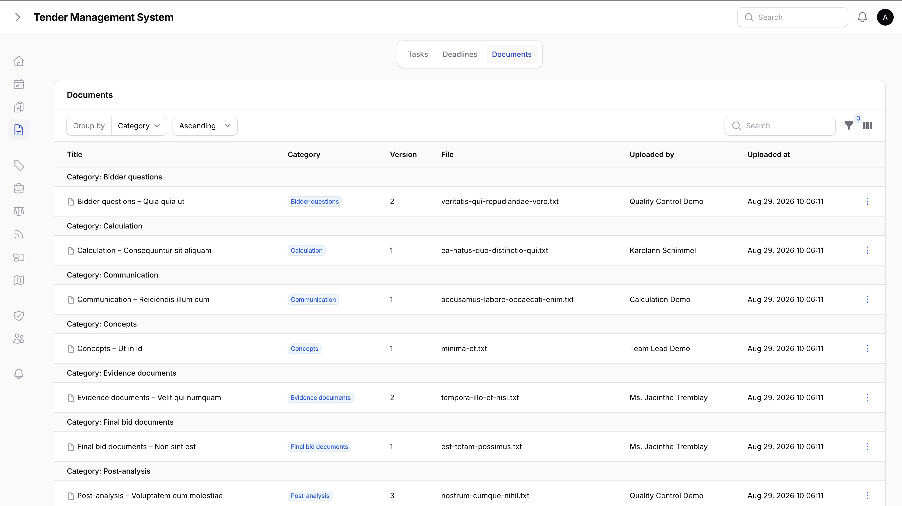
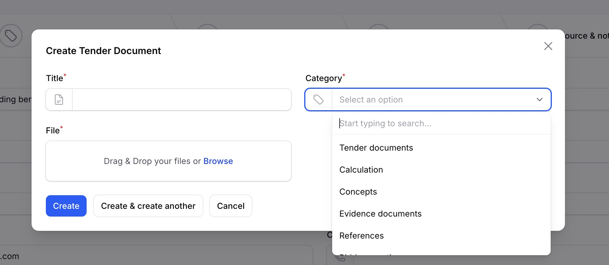
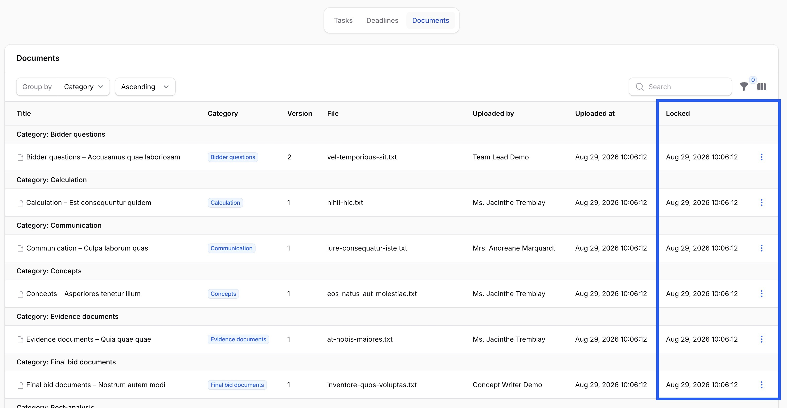

# Tender Documents

_Last updated: 02/09/2026_

Every tender has its own document library, separate from the file attachments you can add to individual tasks (covered in [Collaboration](06-collaboration.md)). It's where the tender's actual paperwork lives, such as the tender documents themselves, the calculation, concepts, evidence documents, and everything else that builds up as a bid moves toward submission.

## Categories

Each document belongs to one of 11 categories: tender documents, calculation, concepts, evidence documents, references, bidder questions, communication, site visit, final bid documents, result, and post-analysis. Grouping by category keeps a tender's growing pile of files organized without you having to invent your own naming scheme.

The **references** and **concepts** categories here are just filing spots for whatever bid-specific files land in them; they're separate from the company-wide reference and concept-block libraries described in [References, Certificates & Concept Library](12-references-certificates-concepts.md), which are reusable across many tenders and linked in from the tender's own Reference Library tab.

Open a tender and go to its **Documents** tab to see the full library, grouped by category, with a filter to narrow it down to one category at a time.

*A tender's document library, grouped by category.*

## Uploading a document and adding new versions

Use **New document** to add a document: give it a title, pick its category, and upload the first file. From then on, uploading a replacement doesn't overwrite the old file, it adds a new version on top of it. The document keeps its full version history, so you can always see what an earlier version looked like and who uploaded each one.

*Adding a new document.*

The table always shows the current (highest-numbered) version's filename, uploader, and upload date. Older versions aren't deleted or hidden, they're just not the one shown by default.

Only people linked to the tender, meaning its owner or one of its team members, or a team lead, department head, or super admin, can upload a document or add a new version.

## Downloading

Files aren't shown inline. Downloading uses a dedicated download link, the same access-checked approach used for task attachments (see [Collaboration](06-collaboration.md)).

## Deleting a document

A document can be deleted by whoever uploaded it or by a team lead, department head, or super admin, as long as it isn't locked (see below).

## The calculation category needs the see-prices right

The **calculation** category is the one exception to "anyone with access to the tender can see its documents." Since calculation documents carry price-sensitive figures, they're only visible to users with the right to see prices, the same right described in [Getting started](02-getting-started.md). If you don't have that right, calculation documents simply don't appear in your Documents tab, and a direct download link to one won't work for you either.

Every other category is visible to anyone who can see the tender.

## Documents lock once a tender reaches submission

Once a tender's status reaches **submission**, every document that already exists at that moment is locked: no new versions can be added, and it can't be deleted. This keeps the final, submitted state of the bid intact and auditable going forward.

*A locked document — no new version or delete action available.*

Documents you add *after* the tender has already reached submission, for example a result document once the outcome is known, aren't affected. Locking only applies to what already existed at the moment of that specific transition.

## Where to go next

- [Calculations & Approvals](10-calculations-approvals.md), covering pricing calculations and the 6-step approval chain that gates final submission. The **calculation** document category above is for supporting pricing documents, separate from the structured calculation covered there.
- [Communication, Site Visits, Submission & Follow-up](13-communication-site-visits-submission.md), covering the structured communication log and document requests, separate from this page's **communication** and **site visit** document categories, which are for attaching actual files.
- [Result & Lessons Learned](14-result-lessons-learned.md), covering the structured Result record and lessons-learned retrospective, separate from this page's **result** and **post-analysis** document categories, which are for attaching actual files.
