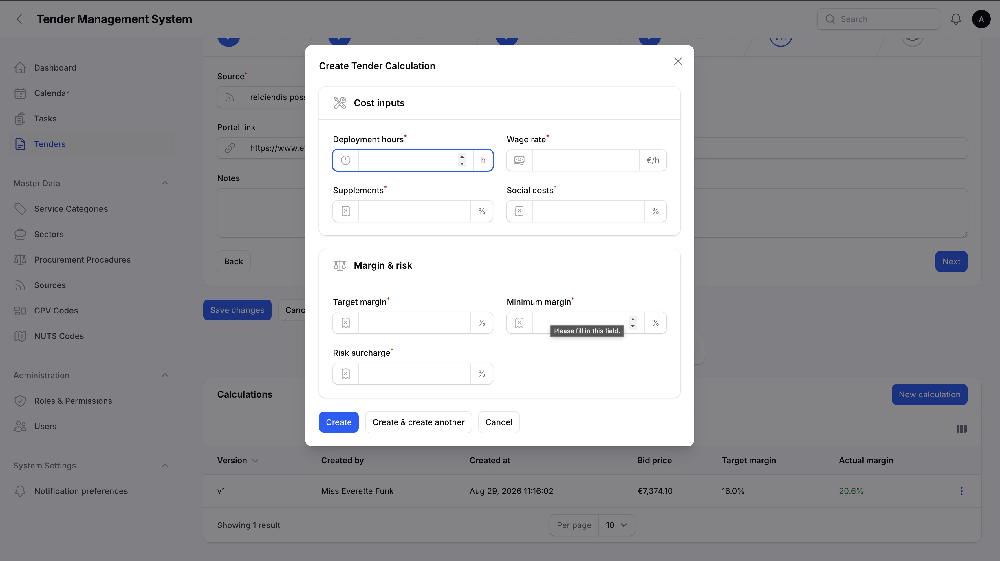
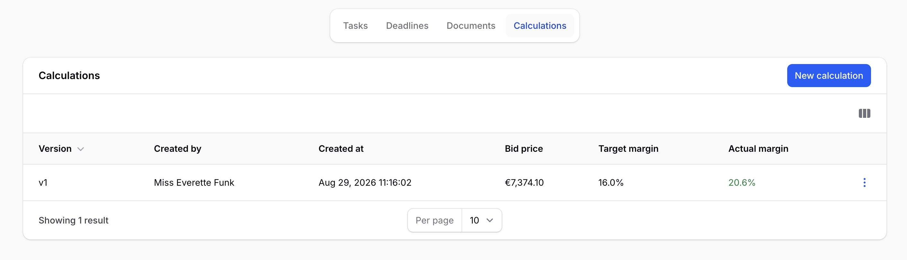
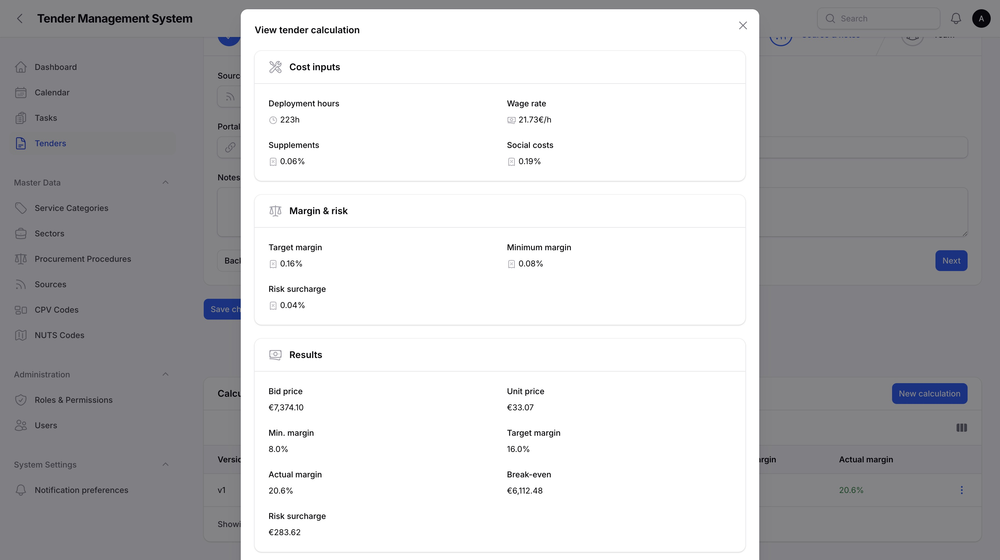
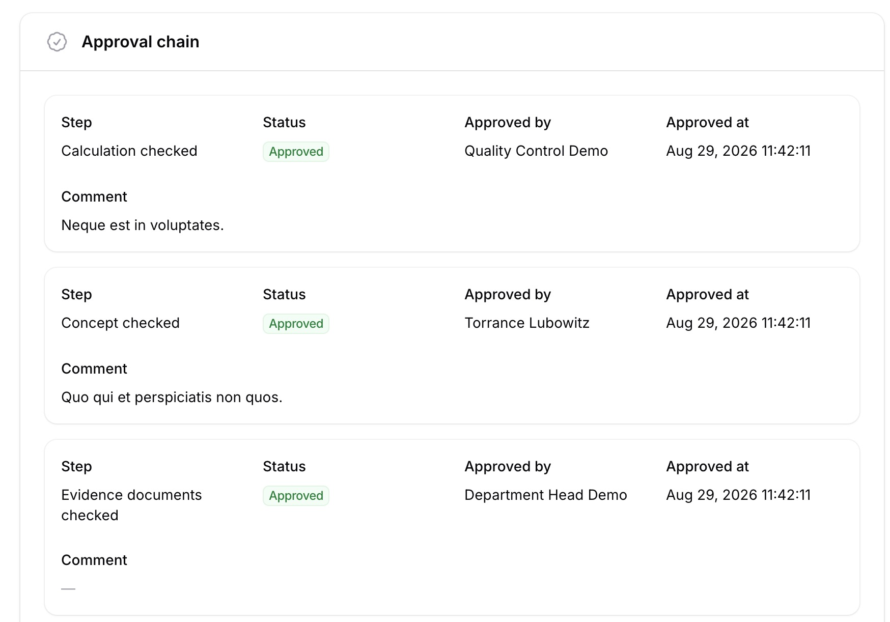

# Calculations & Approvals

_Last updated: 29/08/2026_

Every tender needs a priced calculation before it can be submitted. This page covers entering a calculation, comparing versions, understanding the results, and the 6-step approval chain that has to complete before the tender can reach the **submission** stage.

## Cost-driver fields depend on the tender's service category

What a calculation asks you to fill in depends on the tender's service category. Each category is set up with a pricing model, such as deployment hours or area-based, and a specific list of cost-driver fields for that model, such as hours, wage rate, or area. An administrator configures this per category, covered in [Administration](08-administration.md). If a tender's service category hasn't been set up with a pricing model yet, no calculation can be created for it, and you'll see a message saying so instead of the usual **New calculation** button.

## Creating a calculation

Open a tender and go to its **Calculations** tab, then use **New calculation**. The form is grouped into two sections: **Cost inputs**, the category-specific fields such as hours or wage rate, and **Margin & risk**, the target margin, minimum margin, and risk surcharge every calculation asks for regardless of category. Fill in every required field and save.

*Creating a new calculation, with its inputs grouped into two sections.*

Once saved, the calculation's results, such as its bid price and margins, are computed automatically from what you entered. You don't calculate anything by hand.

## Versions

Every calculation you create becomes a new, numbered version. Nothing is overwritten: the tender's full calculation history stays available, and the **Calculations** tab lists every version side by side so you can compare bid price, margins, and other results across them.

*A tender's calculation versions, listed side by side.*

To start a new version without re-entering everything from scratch, use **Duplicate** on an existing version. It opens the same form pre-filled with that version's inputs, so you only need to change what's actually different, such as an updated wage rate.

## Results and the right to see prices

A calculation's cost inputs and computed results, bid price, unit price, minimum/target/actual margin, break-even, and risk surcharge, are only visible to users with the right to see prices, the same right described in [Getting started](02-getting-started.md). If you don't have that right, the **Calculations** tab is still there so you can see version numbers and who created each one, but the pricing details themselves are hidden, and you can't create or duplicate a calculation either.

Opening a version with **View** shows its full breakdown: the inputs that went in, the results that came out, and, further down, the approval chain covered below.

*A calculation's computed results.*

### How this is calculated

Each pricing model follows a fixed formula, and the view modal includes a collapsed **How this is calculated** section spelling it out step by step, from the category-specific cost inputs through to the final bid price. It's a reference for the formula itself, not a breakdown of one particular calculation's numbers.

## The 6-step approval chain

Before a tender can reach the **submission** stage, its current calculation has to go through 6 approval steps, in order:

| Step | Approved by |
| --- | --- |
| **Calculation checked** | A team member with the Calculation functional role. |
| **Concept checked** | A team member with the Concept functional role. |
| **Evidence documents checked** | A team member with the Evidence documents functional role. |
| **Formal review complete** | A team member with the Quality control functional role. |
| **Management approved** | A team member with the Final approval functional role. |
| **Final submission released** | Anyone with the right to execute final submission. |

Functional roles are the same ones covered in [Team assignment](04-team-assignment.md). Each step can only be approved once every step before it is already approved, so the chain always progresses in the order listed above, and each step records who approved it, when, and an optional comment.

*The approval chain, showing progress step by step.*

From the **Calculations** tab, each version shows an **Approve** action labelled with whatever the next step actually is. It's only visible to someone eligible to approve that specific step, and it automatically moves to the next step in the chain once used.

If a calculation's actual margin comes out below the category's minimum margin, there's no special override: **Management approved** still has to happen like every other step, so a below-minimum calculation always gets a management sign-off before it can go any further.

## Submission is gated on the chain, not on tasks

A tender can't move from **quality** to **submission** until its current calculation's approval chain is fully complete, all 6 steps approved. This replaced the earlier rule based on open tasks, covered in [Managing tenders](03-managing-tenders.md). If the chain isn't complete, **submission** simply won't appear in the list of next stages available on the tender.

## Where to go next

- [Managing tenders](03-managing-tenders.md), covering the tender lifecycle and the submission stage this chain gates.
- [Team assignment](04-team-assignment.md), covering the functional roles that approve steps 1 through 5 of the chain.
- [Administration](08-administration.md), covering how a service category's pricing model and cost-driver fields are configured.
