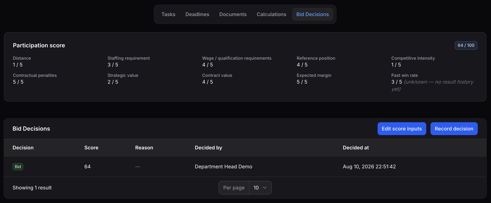
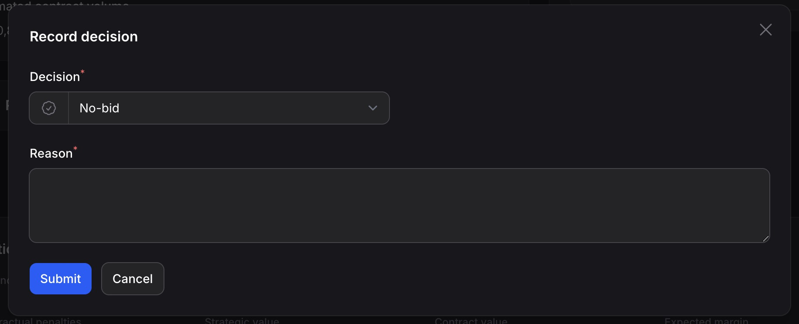
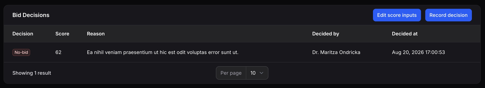

# Bid / No-Bid Decision

_Last updated: 01/09/2026_

Before committing real effort to a tender, it helps to weigh whether pursuing it is actually worthwhile. This page covers the participation score, a decision-support number built from the tender's own data, and the bid/no-bid decision itself, which a person with the right to do so records against the score.

The system never decides this for you. The score is there to inform the call, not to make it.

## The participation score

Open a tender and go to its **Bid decision** tab. Near the top is a summary of the participation score, made up of ten factors, each rated from 1 to 5, and combined into a single score from 0 to 100.

*The participation score summary, above the decision history.*

Three of the ten factors are worked out automatically from data already recorded elsewhere on the tender:

- **Contract value**, from the estimated contract volume set when the tender was created.
- **Expected margin**, from the actual margin of the tender's current calculation. See [Calculations & Approvals](10-calculations-approvals.md) for where that number comes from.
- **Past win rate**, which has no source yet in this version of the system, so it's always shown at a fixed, neutral rating with a note that it's unknown rather than a real measurement.

The other seven factors have no existing data to draw on, so they're entered by hand: distance, staffing requirement, wage/qualification requirements, reference position, competitive intensity, contractual penalties, and strategic value.

Until all seven manual ratings are filled in, the score shows as incomplete, with a count of how many ratings are still missing, rather than a misleading partial number.

### Entering the manual ratings

If you have the right to make bid decisions, use **Edit score inputs** on the **Bid decision** tab to rate the seven manual factors from 1 to 5. Save to update the summary. There's no separate approval step for this; anyone with the right can revise the ratings at any time, and the summary always reflects the latest values.

The score itself is never stored. It's worked out fresh every time it's shown, from whatever the ratings and the linked calculation currently say. That means if the estimated contract volume or the calculation's margin changes later, the score updates with it automatically, rather than going stale.

## Recording a bid/no-bid decision

Once you're ready to make the call, use **Record decision** on the same tab. Choose **Bid** or **No-bid**, and if you choose **No-bid**, a reason is required. This is enforced by the system, not just a form hint, so a decline can never be logged without an explanation on file.

*Recording a decision, with a reason required for a decline.*

The tender's participation score at that exact moment is captured and stored alongside the decision, so the historical record of what the score looked like when the call was made survives any later change to the ratings or the calculation.

Every decision you record is added to the tender's decision history rather than replacing the previous one. If circumstances change and the call needs to be revisited, record a new decision instead of editing the old one. The full history, including any earlier decisions and their reasons, stays visible on the **Bid decision** tab.

*The decision history, listing every decision recorded for a tender.*

## Who can do what

Viewing the participation score and the decision history is available to anyone who can see the tender at all, the same category-based visibility described in [Getting started](02-getting-started.md). Entering the manual ratings and recording a decision both require the right to make bid decisions, a specific right an administrator grants independently of role, covered further in [Administration](08-administration.md).

By default, super admins, department heads, and team leads hold this right; calculation and staff roles don't, though your organization's administrator can adjust this per role.

## The decision doesn't block the tender's progress

Recording a bid/no-bid decision, in either direction, has no effect on the tender's status or what stages it can move to next. A tender can still be moved forward through **intake**, **review**, **decision**, and beyond regardless of what's recorded here, or with nothing recorded at all. See [Managing tenders](03-managing-tenders.md) for the full status flow and what actually gates it.

## Where to go next

- [Calculations & Approvals](10-calculations-approvals.md), covering the calculation whose margin feeds the expected margin factor.
- [Managing tenders](03-managing-tenders.md), covering the tender lifecycle this decision does not gate.
- [Administration](08-administration.md), covering how rights, including the right to make bid decisions, are assigned.
