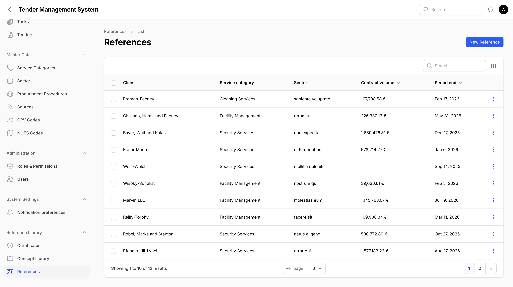
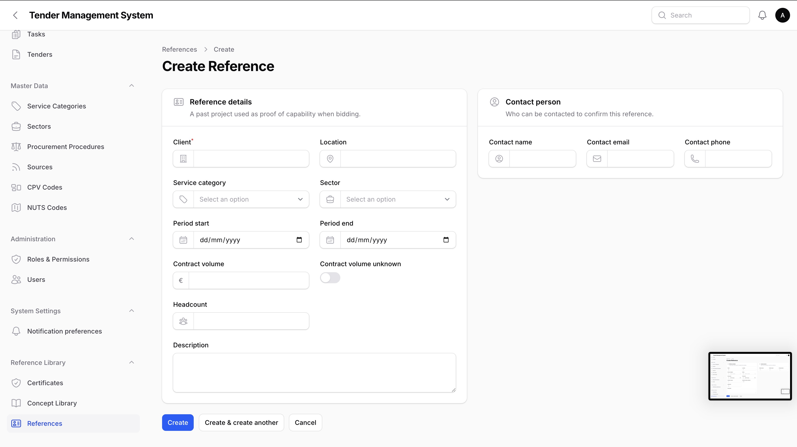
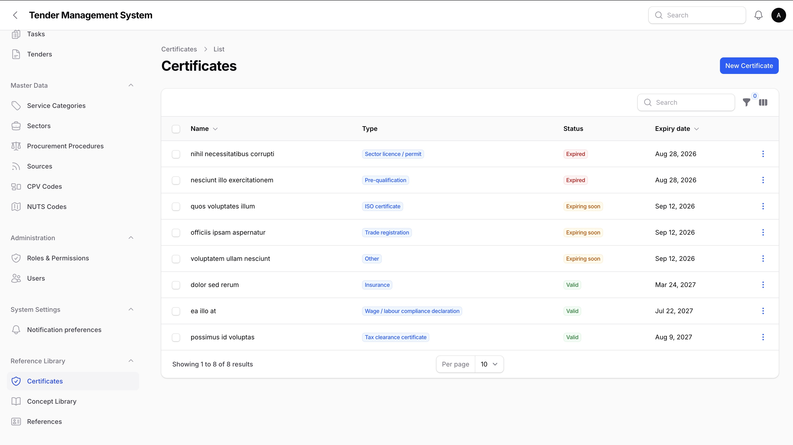
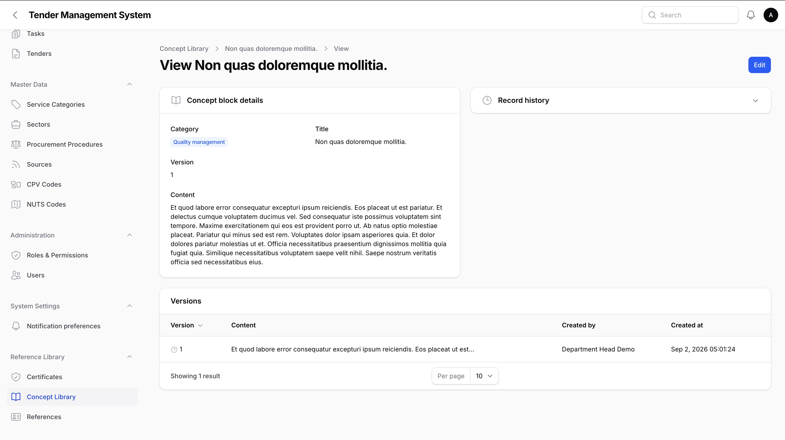
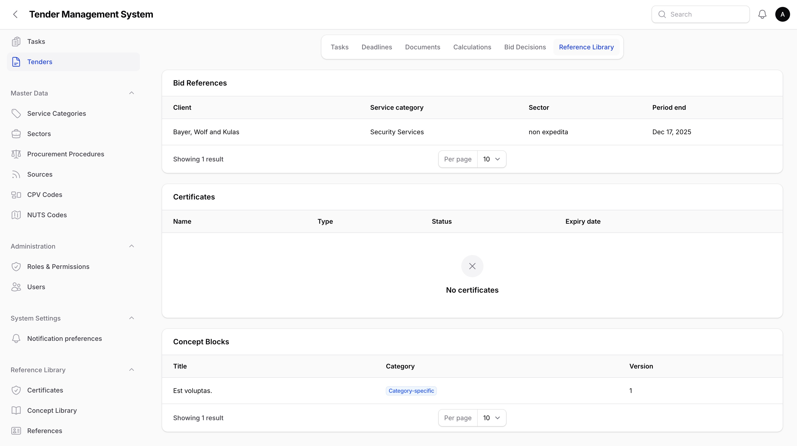

# References, Certificates & Concept Library

_Last updated: 02/09/2026_

Some material gets reused across many bids: past project references, company certificates, and standard write-ups like your quality management approach or staffing concept. Rather than recreating this content for every tender, the system keeps it in three company-wide libraries, found under the **Reference Library** navigation group, and lets you link the relevant items to a specific tender when you're putting a bid together.

## The three libraries

### References

A reference is a record of a past project you can point to as evidence of your capability. Open **Reference Library > References** to see the list, or create a new one.

Each reference holds the client name, location, service category and sector, the contract period, the contract volume (or a toggle marking it as unknown, the same pattern used for a tender's estimated contract volume), headcount, a description, and a contact person's name, email and phone. You can attach one or more supporting files, such as a reference letter, on the reference's **Attachments** tab; each attachment downloads through the same access-checked link used elsewhere in the system rather than opening inline.

*The References list.*

*Creating a new reference.*

Any panel user can create, edit, and delete references; there's no dedicated right for this library.

### Certificates

A certificate is a company credential such as an insurance policy, an ISO certificate, a trade registration, a sector licence, a tax clearance certificate, a wage/labour compliance declaration, or a pre-qualification. Certificates carry more weight than the other two libraries: a lapsed certificate can disqualify a bid outright, so this library is gated behind a dedicated right and comes with automatic expiry reminders.

Each certificate holds a type, a name, an optional issuing body, a valid-from date, an expiry date, an optional file upload, and free-text notes. Its status, shown as a green/orange/red badge in both the list and the certificate's own page, is worked out from today's date rather than stored: valid, expiring soon (within 30 days of expiry), or expired.

*The Certificates list, with its status badge.*

Only users holding the **Manage certificates** right can see or use this library at all, including viewing the list; by default this is granted to super admins and department heads only. See [Administration](08-administration.md) for how rights are assigned.

#### Expiry reminders

The system checks certificate expiry dates once a day. Everyone holding the Manage certificates right gets a notification, in the notification centre and by email depending on their notification preferences, at 90, 30, and 7 days before a certificate's expiry date, and one final notice once it has actually expired. Each of these four reminders fires once per certificate; if the check hasn't run for a while and a certificate crosses more than one threshold in the meantime, every newly-crossed reminder fires in that same run rather than only the nearest one.

### Concept library

A concept block is a reusable piece of write-up, such as your quality management approach, staffing concept, cover arrangements, escalation procedure, complaints handling, sustainability approach, training programme, or deployment organisation, kept under **Reference Library > Concept Blocks**. Each block has a category and a title.

Unlike references and certificates, a concept block keeps a full version history rather than being overwritten in place. Editing a block's content on save creates a new version rather than replacing the old one; the block's own page has a **Versions** tab listing every version, newest first, and none of them can be edited or deleted once created. If you save an edit without actually changing the content, no new version is created.

*A concept block's version history.*

Any panel user can create and edit concept blocks; there's no dedicated right for this library either.

## Attaching library records to a tender

Open a tender and go to its **Reference Library** tab. It has three sub-tabs, one per library, each listing what's currently linked to this tender and letting you attach more or detach what's no longer relevant.

*The tender's Reference Library tab.*

Attaching a reference or a certificate to a tender is a straightforward link: the same visibility rules that apply to the tender's team and document uploads apply here, so anyone who can manage the tender's team, or who's already linked to it through its documents, can attach and detach references. Certificates are the exception: attaching or detaching a certificate on a tender requires the Manage certificates right, the same right that gates the certificate library itself, since recording which certificate backs a bid carries the same disqualification-risk weight as the certificates themselves.

### Concept blocks freeze the version used

Attaching a concept block works a little differently. When you attach a block to a tender, the system records exactly which version of that block was current at that moment, not just a link to the block in general. If someone later edits the concept block and creates a new version, the tender keeps pointing at the version that was actually attached, not the newer one.

This matters because it means what a past bid is recorded as having submitted never silently changes underneath it. If a tender needs the newer wording, the block has to be reattached (or the version otherwise updated) deliberately; it never happens automatically as a side effect of editing the source block elsewhere.

There's no option to pick an older version when attaching for the first time; attaching always pins whatever the block's current version is at that moment.

## Who can do what

| Action | References | Certificates | Concept blocks |
| --- | --- | --- | --- |
| View the library | Any panel user | Manage certificates right | Any panel user |
| Create / edit / delete in the library | Any panel user | Manage certificates right | Any panel user |
| Attach / detach on a tender | Team manager or tender-linked user | Manage certificates right | Team manager or tender-linked user |

## Where to go next

- [Administration](08-administration.md), covering how the Manage certificates right is assigned.
- [Tender Documents](09-tender-documents.md), covering the per-tender document categories (including a `References` and `Concepts` category) these company-wide libraries are distinct from.
- [Managing tenders](03-managing-tenders.md), covering the tender lifecycle these libraries link into.
