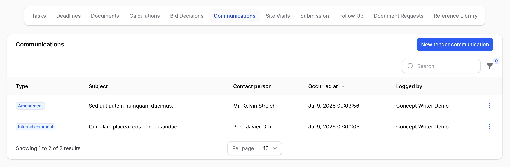
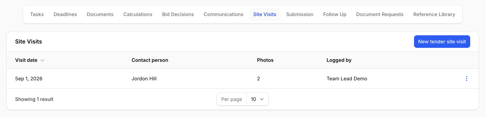
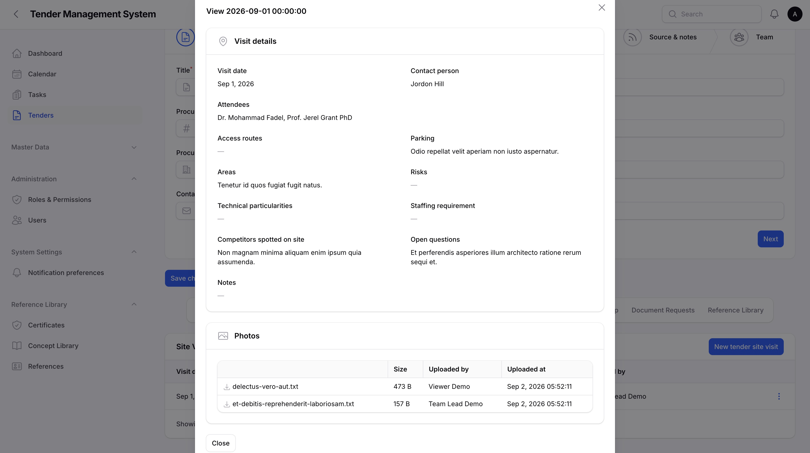
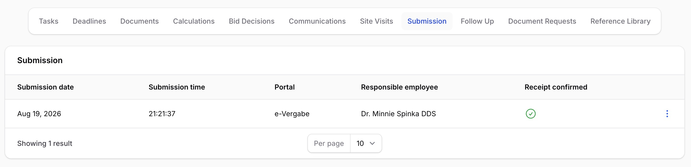
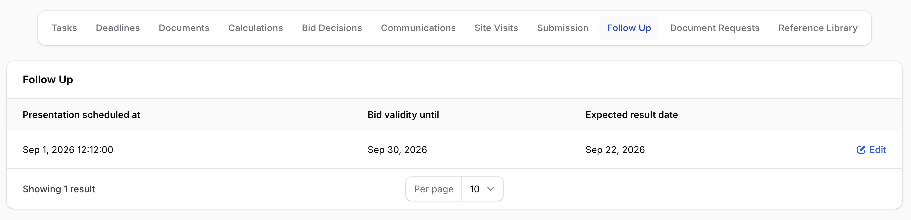
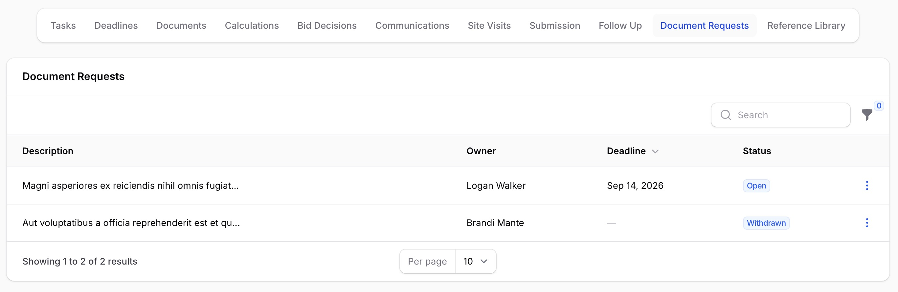
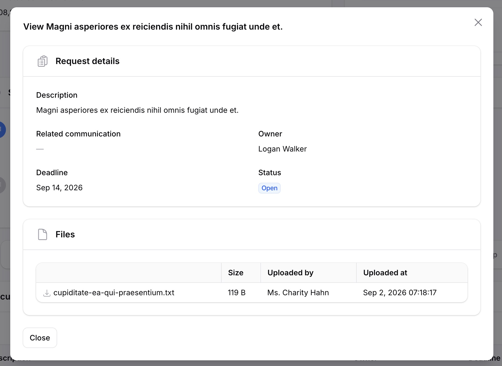

# Communication, Site Visits, Submission & Follow-up

_Last updated: 02/09/2026_

Once a tender is underway, there's a lot to keep track of beyond documents and calculations: questions and clarifications with the contracting authority, site visits, the actual act of submitting the bid, and what happens afterward while you wait for a result. This page covers the five tabs on a tender's detail page that track all of that: **Communication**, **Site Visits**, **Submission**, **Follow-up**, and **Document Requests**.

## Communication log

The **Communication** tab is a structured, chronological log of everything exchanged with or about the contracting authority: bidder questions, clarifications, amendments, emails, phone calls, and internal comments. Each entry records its type, a subject, the content, an optional contact person, and when it happened.

*The Communication tab, listing logged entries by type.*

Use **New communication entry** to add one, choosing the type from the six available. Once logged, an entry can still be edited later, for example to fix a typo or add more detail, but it can never be deleted. This keeps the log a reliable record of what was actually communicated, rather than something that can be quietly cleaned up afterward.

Only the person who logged an entry, or a team lead, department head, or super admin, can edit it afterward. Anyone linked to the tender can add new entries.

This log is separate from the tender's document library. If a communication also comes with an actual file, such as an email attachment or a formal amendment document, attach it on the **Documents** tab under the **Communication** or **Bidder questions** category instead, described in [Tender Documents](09-tender-documents.md). The Communication tab logs the exchange itself; the document library holds the files.

## Site visits

Some tenders involve visiting the client's site before bidding, sometimes more than once. The **Site Visits** tab holds one entry per visit, recording the visit date, who attended (a free-text field, since attendees are often external people who aren't system users), a contact person, and a set of free-text notes covering access routes, parking, the areas involved, risks, technical particularities, staffing requirements, competitors spotted on site, and open questions.

*The Site Visits tab, listing recorded visits.*

Photos from a visit are added separately, after the visit itself is created: open the visit's actions and use **Upload photo**. Uploaded photos appear in the visit's detail view, each with a download link.

*Viewing a site visit's details and photos.*

A site visit can be deleted by whoever created it, or by a team lead, department head, or super admin; deleting a visit also removes any photos attached to it. Anyone else linked to the tender can still view and add visits, but can't delete one they didn't create.

## Submission record

The **Submission** tab holds a single record for how and when the bid was actually submitted: the submission date and time, the responsible employee, the portal or channel it went through, the transmission route, whether receipt has been confirmed by the contracting authority, and any notes. There's only ever one submission record per tender; once it exists, you edit it rather than creating a new one.

*The Submission tab, showing the recorded submission.*

Turning on **Receipt confirmed** stamps the current date and time automatically; turning it back off clears that timestamp. You never enter the confirmation time by hand.

Supporting files, such as the submitted bid document itself or a confirmation email, are added the same way as site visit photos: use **Upload file** from the record's actions, and download any file later from the same view.

## Follow-up tracking

After submission, the **Follow-up** tab tracks what happens while the outcome is still pending: a scheduled presentation date with its own notes, negotiation notes, how long the bid remains valid, and the expected result date with any notes on what's anticipated. Like the submission record, there's only ever one follow-up record per tender.

*The Follow-up tab, showing presentation, negotiation, and expected-result details.*

Receipt confirmation lives on the Submission tab above, and any queries during this phase are logged as ordinary Communication entries, so neither is duplicated here.

## Document requests

Sometimes the contracting authority asks for additional documents after submission, or during the process, and that request needs its own tracking rather than just a note somewhere. The **Document Requests** tab treats each request as a small, tracked task: a description of what's needed, who owns getting it done, an optional deadline, an optional link back to the Communication entry the request arose from, and a status.

*The Document Requests tab, listing requests with their owner, deadline, and status.*

A request moves through four statuses: **open**, **in progress**, **fulfilled**, or **withdrawn**. Use **Change status** on a request to move it forward, optionally with a reason; every status change is recorded, including who made it and when, so the full history of a request is always visible on its detail view.

*Viewing a document request's details, files, and status history.*

Files satisfying the request are added with **Upload file**, the same pattern used elsewhere on these tabs. There's no way to delete a document request outright; once one is no longer needed, withdraw it instead, so the record of what was asked for and why is never lost.

## Who can do what

Across all five tabs, adding and managing entries is available to anyone linked to the tender (its owner, a team member, or a team lead, department head, or super admin), the same access pattern used for the tender's document library, described in [Tender Documents](09-tender-documents.md). Viewing is available to anyone who can see the tender at all.

Two things are more restricted than the rest: editing a Communication entry is limited to whoever logged it, plus team lead, department head, or super admin, and deleting a site visit is limited to whoever created it, plus the same management roles.

## Where to go next

- [Managing tenders](03-managing-tenders.md), covering the tender lifecycle and the document-requests, presentation, and negotiation deadline types that pair with this page's tracking.
- [Tender Documents](09-tender-documents.md), covering the document library's own Communication and Site visit categories for attaching files, as distinct from the structured logs on this page.
- [Calculations & Approvals](10-calculations-approvals.md), covering the calculation approval chain that gates reaching the submission stage in the first place.
