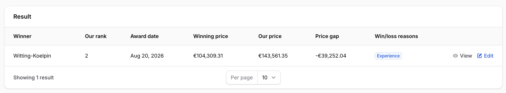
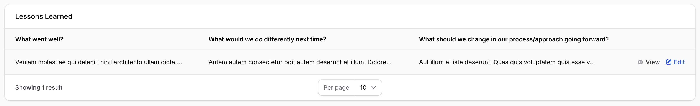

# Result & Lessons Learned

_Last updated: 02/09/2026_

Once a tender reaches an outcome, whether that's won, lost, cancelled, not evaluated, or excluded, there's value in recording what actually happened and what to learn from it. This page covers the two tabs on a tender's detail page that capture that: **Result** and **Lessons Learned**, both grouped under the **Closure** tab group alongside Submission and Follow-up.

Both tabs only become available for creating a new entry once the tender has reached one of its five terminal statuses. Before that, the tabs are visible but there's nothing to add yet.

## Result

The **Result** tab records the outcome of the procedure: who won, where we ranked, the award date, what's known about how the contracting authority evaluated the bids, our own reasoning about the outcome, and the client's own stated award decision.

*The Result tab, showing the recorded outcome.*

There's only ever one result record per tender; once it exists, **New result** disappears and you edit the existing record instead.

The fields are:

- **Winner**: a free-text name of the winning bidder. This isn't linked to a structured competitor record, it's just plain text.
- **Our rank**: where our bid placed, as a number.
- **Award date**: when the contract was awarded.
- **Known evaluation**: free-text notes on how the contracting authority evaluated the bids, to the extent that's known.
- **Reasoning**: our own internal analysis of why the outcome happened.
- **Award decision**: the client's own stated rationale for the award, for example quoted from the official award notice. This is kept separate from Reasoning above, which is our own take.
- **Win/loss reasons**: a multi-select list of contributing factors, since an outcome is often caused by more than one thing at once. The twelve available reasons are: Price, Quality, Concept, References, Experience, Staffing, Formal error, Exclusion, Capacity, Contract terms, Competitor, and Strategic decision.

### Prices and price gap

Three fields, **Winning price**, **Our price**, and **Price gap**, only appear for users who hold the same "see prices" right used throughout the rest of the system, for example on calculations. Users without that right don't see these fields at all, on the form or in the table.

Price gap isn't something you enter. It's calculated automatically as winning price minus our price whenever both prices are present, and shown as read-only. If either price is missing, the gap is shown as unknown rather than guessed at.

### Supporting documents

The Result tab doesn't have its own file uploads. If you have supporting files, such as the official award notice or a post-award debrief, attach them on the **Documents** tab instead, under the **Result** or **Post-analysis** category, described in [Tender Documents](09-tender-documents.md).

## Lessons Learned

The **Lessons Learned** tab captures a short retrospective on the tender, using the same three questions every time regardless of the outcome:

1. What went well?
2. What would we do differently next time?
3. What should we change in our process/approach going forward?

*The Lessons Learned tab, showing the recorded retrospective.*

All three answers are required. Like the Result record, there's only one lessons-learned entry per tender; once it exists, **New lessons learned entry** disappears and you edit the existing entry instead.

Answers can be corrected afterward, for example to fix a typo or add detail, but an answer can never be cleared out to blank. This is meant to keep the retrospective retained permanently rather than something that quietly gets edited away over time. There's no way to delete a lessons-learned entry at all.

## Who can do what

Creating and editing on both tabs follows the same access pattern as the tender's document library and other Closure/Engagement tabs: anyone linked to the tender (its owner, a team member, or a team lead, department head, or super admin) can add and edit entries, described further in [Tender Documents](09-tender-documents.md). Anyone who can see the tender at all can view both tabs, subject to the separate price-visibility right described above.

## Where to go next

- [Managing tenders](03-managing-tenders.md), covering the tender lifecycle and the terminal statuses (won, lost, cancelled, not evaluated, excluded) that unlock these two tabs.
- [Tender Documents](09-tender-documents.md), covering the document library's own Result and Post-analysis categories for attaching supporting files, as distinct from the structured records on this page.
