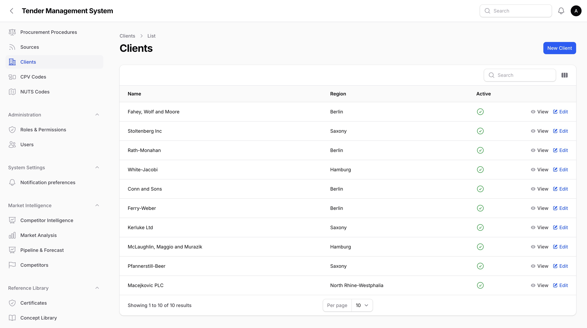
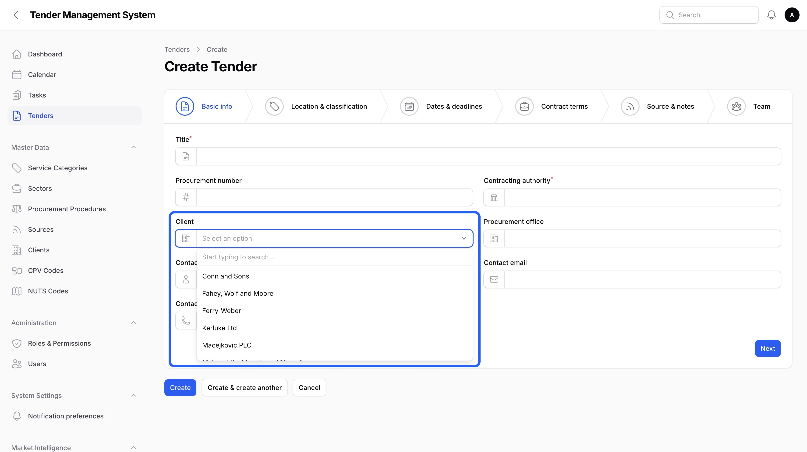
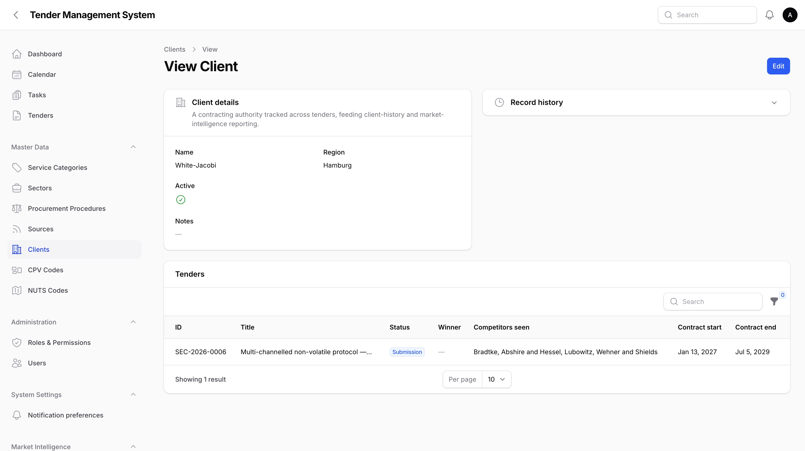
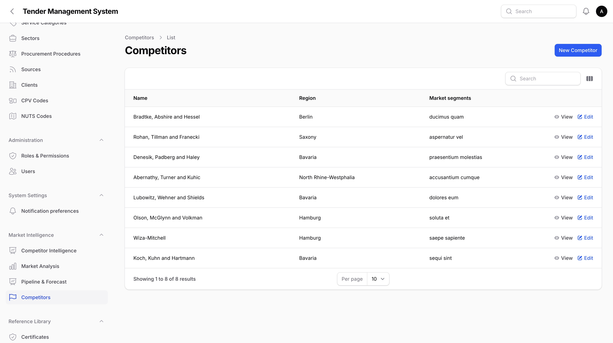
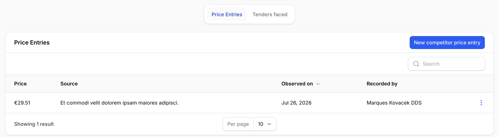
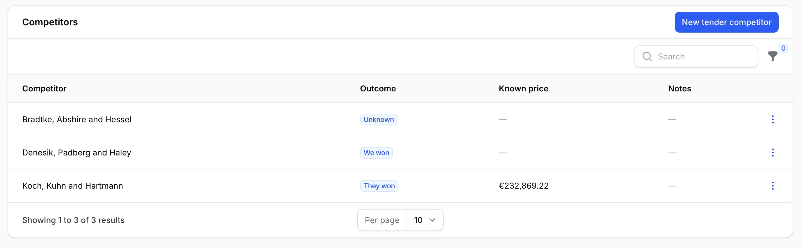
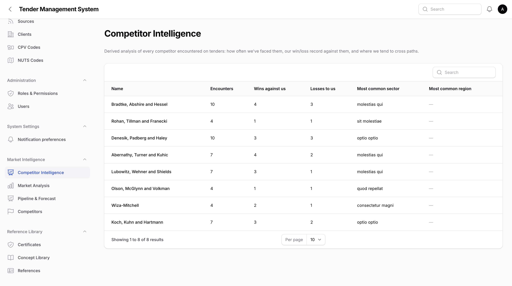
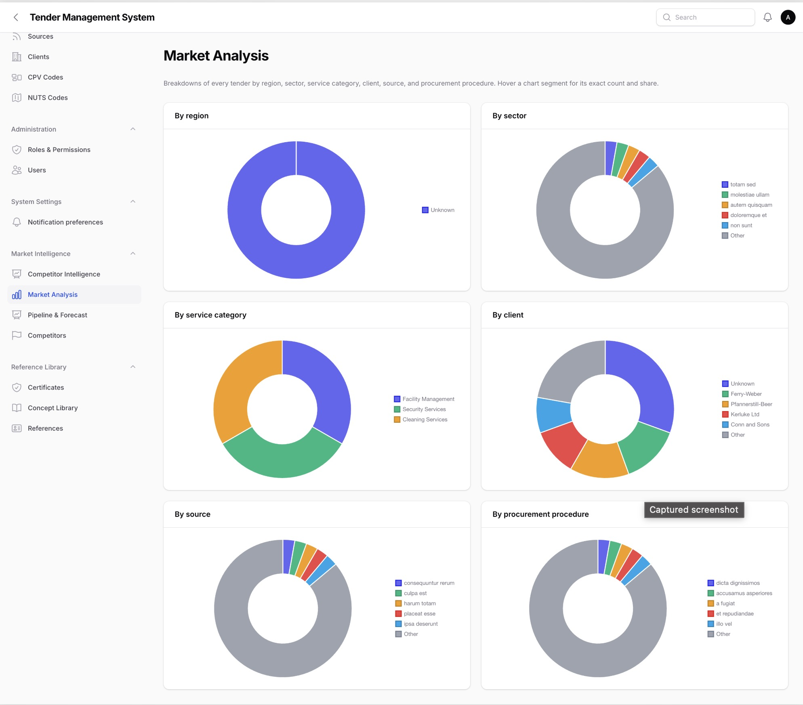
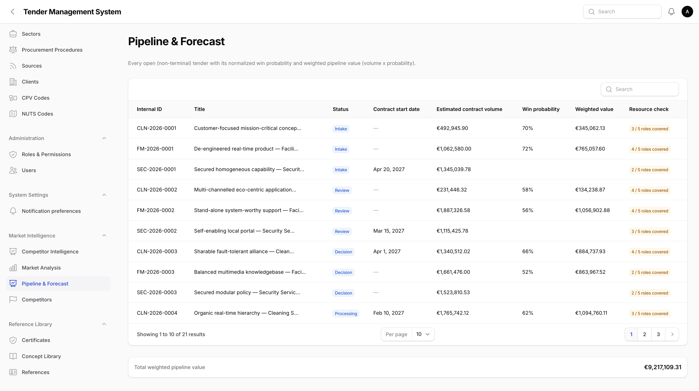

# Competitors, Market Intelligence, Client History & Pipeline

_Last updated: 04/09/2026_

This page covers everything TMS tracks beyond a single tender: known clients and their history across multiple tenders, known competitors and what's been observed about them, and two reporting pages that roll all of that up into a market view and a forward-looking pipeline forecast.

Most of what's covered here lives in a new **Market Intelligence** section of the main navigation, alongside the tender-specific tabs described in earlier pages.

## Clients

A **Client** is the contracting authority behind a tender, tracked as its own record rather than just free text. This lets history build up across every tender issued by the same authority, which is what the Client History section further down is built on.

Clients are managed from the **Clients** list, one of the reference-data tables described in [Administration](08-administration.md): a simple name, region, and notes, plus the same active/inactive flag used by other lookup tables. Like every other reference-data table, a client is never deleted, only deactivated, so client history stays intact even for an authority you no longer bid for.

*The Clients list.*

When creating or editing a tender, you can optionally link it to a client using a dropdown right next to the existing **Contracting authority** text field. The text field itself still exists and is still required. Linking a client is additional and optional, it doesn't replace typing the authority's name. Only active clients appear in the dropdown.

*The optional Client field on the tender form, next to the existing Contracting authority text field.*

## Client history

Open a client from the Clients list to see its history: every tender linked to that client, in one read-only table. This is the same idea as a tender's own detail page, just from the client's side.

*A client's history of linked tenders.*

Each row shows the tender's status, the recorded winner (from its Result tab, see [Result & Lessons Learned](14-result-lessons-learned.md)), which competitors were seen on it, and its contract start and end dates. This table is entirely read-only. A tender's client link, result, and competitor sightings are all entered from the tender itself, not from here.

### Contract renewal reminders

If a tender has a known contract end date, TMS automatically reminds the tender's owner and the relevant team leads and department heads as that date approaches, at 12 months, 9 months, and 6 months out. Each threshold only fires once, so you won't be reminded again and again for the same tender.

This runs regardless of the tender's outcome, including tenders that were lost. A lost contract ending is still useful to know about, since it may be worth re-bidding when it comes back to market.

These reminders appear in the notification centre and follow the same email preferences as everything else described in [Notifications](07-notifications.md).

## Competitors

A **Competitor** is a company TMS tracks for market intelligence: their known service areas and clients, and a running assessment of their strengths, weaknesses, and market segments.

Competitors are only visible to users who hold the "see competitor data" right. Without it, the Competitors section doesn't appear in navigation at all. By default this is a right your administrator grants individually, the same way as any other right described in [Administration](08-administration.md).

*The Competitors list, visible only with the "see competitor data" right.*

Opening a competitor shows its full profile plus two tabs:

- **Price entries**: a running log of observed prices for that competitor. Every entry requires a **source**, for example a tender result notice or a client conversation, so that any price on file can be traced back to where it came from. This log is append-only: an entry can be corrected afterward but never deleted, keeping the price history intact.
- **Tenders faced**: a read-only list of the tenders where this competitor was seen, described next.

*A competitor's price entry history.*

### Recording a competitor on a tender

From a tender's own detail page, the **Competitors** tab (grouped with the other Engagement tabs) lets you record which competitors were seen on that specific tender, and what happened: whether we won, they won, or it's unknown, along with their known price on that tender and any notes. Unlike the append-only price-entry log, a competitor sighting on a tender can be freely corrected or removed, since it's just a record of what was observed rather than a compliance-driven audit trail.

*Recording a competitor sighting on a tender.*

This same sighting also shows up read-only on the competitor's own **Tenders faced** tab, so you can see a competitor's full history across every tender from either direction.

## Competitor Intelligence

The **Competitor Intelligence** page, also gated behind the "see competitor data" right, turns every recorded sighting into a per-competitor summary: how many times we've encountered them, how many times they've won against us, how many times we've won against them, and the sector and region we most commonly cross paths with them in.

*The Competitor Intelligence page, summarizing encounters and win/loss record per competitor.*

Every number here is derived live from the Competitors tab entries recorded across all tenders. There's nothing to configure or enter directly on this page.

## Market Analysis

The **Market Analysis** page is open to any user, since it only shows aggregate counts rather than any competitor or pricing detail. It breaks down every tender you can see by region, sector, service category, client, source, and procurement procedure, each as its own simple count table.

*The Market Analysis page's breakdown tables.*

Like everywhere else in TMS, what counts as "every tender you can see" depends on your category scope, described in [Getting started](02-getting-started.md). A tender with no client or region set is grouped under "Unknown" in the relevant breakdown rather than being left out of the count.

## Pipeline & Forecast

The **Pipeline & Forecast** page lists every tender that hasn't yet reached a final outcome, alongside figures useful for forecasting: the estimated contract volume, a win probability, a weighted value, and a rough staffing indicator.

*The Pipeline & Forecast page.*

- **Win probability** is the same participation score used in the bid/no-bid decision, described in [Bid / No-Bid Decision](11-bid-no-bid-decision.md), shown as a percentage. If the score hasn't been fully filled in yet, it shows as "Incomplete" rather than a number.
- **Weighted value** is the estimated contract volume multiplied by that win probability. If either figure is missing, this shows as unknown rather than guessing.
- **Resource check** is a rough coverage indicator, counting how many of the tender's five team functions already have someone assigned. It's meant as a quick signal to flag understaffed tenders, not a real capacity-planning system.
- A totals row at the bottom of the page adds up the weighted value across the whole pipeline.

The estimated contract volume and weighted value columns, along with the totals row, only appear for users who hold the "see prices" right, the same one used throughout the rest of the system, for example on calculations.

## Where to go next

- [Administration](08-administration.md), covering the Clients reference-data table and how rights like "see competitor data" are granted.
- [Bid / No-Bid Decision](11-bid-no-bid-decision.md), covering the participation score that the Pipeline & Forecast page's win probability is drawn from.
- [Result & Lessons Learned](14-result-lessons-learned.md), covering the Result tab whose recorded winner feeds a client's history table.
- [Dashboards, Search, Statistics, Archive & Reporting](17-dashboards-search-statistics-reporting.md), covering the Reports page's competitors and pipeline exports, which reuse the Competitor Intelligence and Pipeline & Forecast pages covered here.
