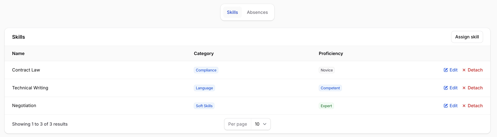
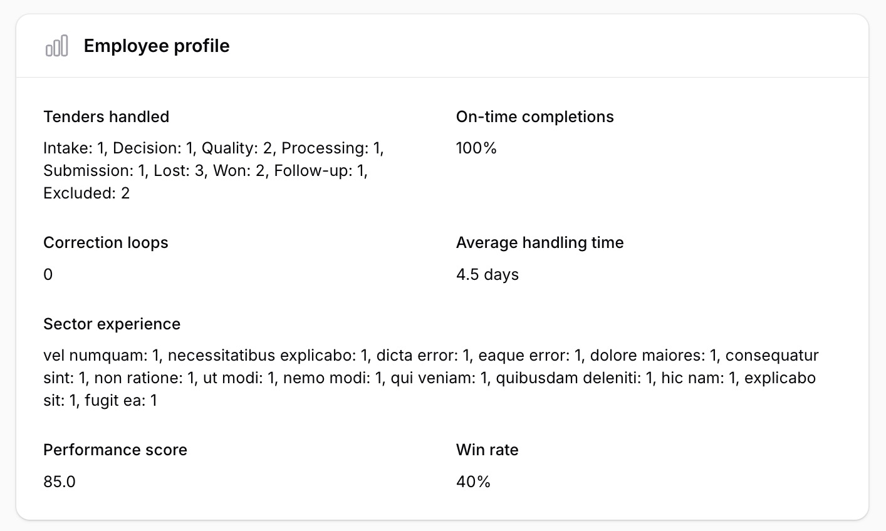
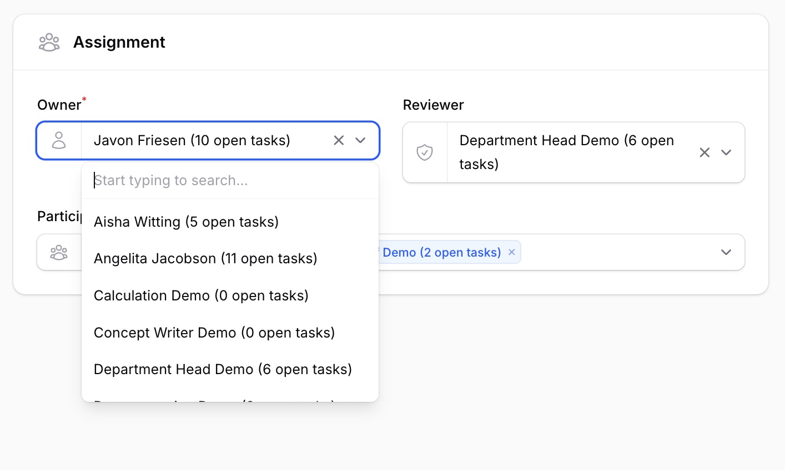
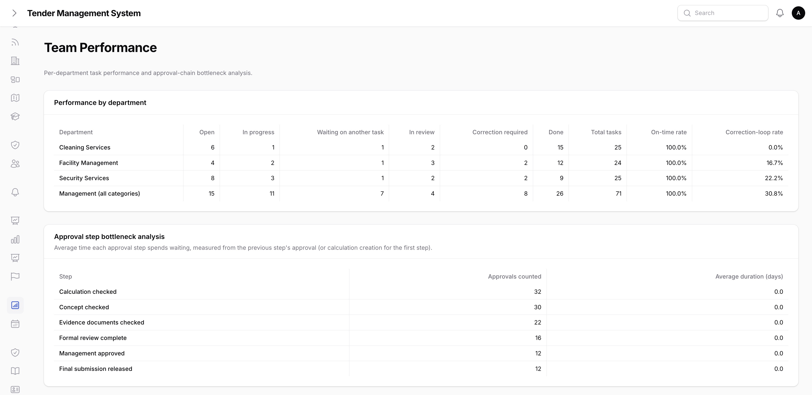
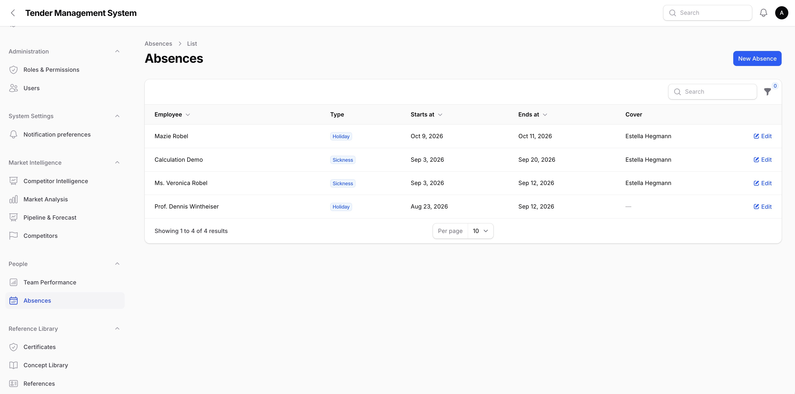
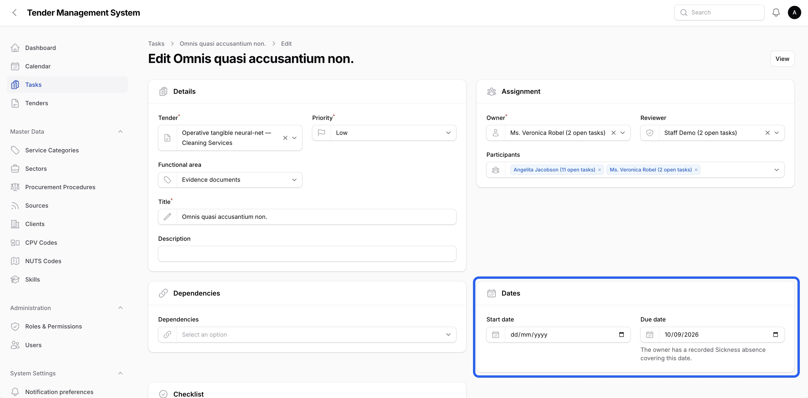

# People, Teams & Cover

_Last updated: 04/09/2026_

This page covers everything TMS tracks about the people doing the work, beyond simply assigning them to a tender or task: what skills they have, a profile of their own activity and performance, how the team is doing as a whole, and how absences and cover are recorded.

Team performance and absences live in a new **People** section of the main navigation. Skills are managed alongside the other reference data described in [Administration](08-administration.md), and an employee profile is reached from that same user's entry in the user list.

## Skills matrix

Every user can have a set of skills recorded on their profile, each with a proficiency level of **novice**, **competent**, or **expert**. A skill is something like "Contract Law", "Technical Writing", or a specific certification, tracked as its own reference-data entry so the same skill name is reused consistently across every employee rather than retyped freely each time.

Skills themselves are managed from the **Skills** list, one of the reference-data tables described in [Administration](08-administration.md). Assigning a skill to a specific user, along with their proficiency level, is done from that user's own edit page.

*Assigning skills and proficiency levels on a user's profile.*

## Employee profile

Every user has a profile page bringing together their skills matrix and a set of computed statistics about their actual work history: which tenders they've handled and in what status, their on-time task completion rate, how often their work has bounced back for correction, their average task handling time, and which sectors they have experience in.

*An employee profile page's computed statistics.*

"Tenders handled" counts any tender the user has actually contributed to, not just tenders formally assigned to them. Owning the tender, being a team member on it, owning a task on it, or being a participant on one of its tasks all count.

You can always view your own profile, with no special right needed. Viewing someone else's profile requires the "view employee statistics" right, one of the individually grantable rights described in [Administration](08-administration.md). Without it, you can still see your own numbers, but not anyone else's.

## Workload indicator

When assigning a task's owner, reviewer, or participants, each candidate's name is shown alongside their current number of open (not yet done) tasks, for example "Jane Doe (4 open tasks)". This is meant to be checked before piling more work onto someone who's already stretched thin, without needing to leave the task form to go look it up.

*The workload indicator on the task owner field.*

This is a live count, not a stored figure, so it always reflects each person's current workload at the moment you're assigning the task. See [Tasks](05-tasks.md) for the rest of the task assignment form.

## Team performance & bottleneck analysis

The **Team Performance** page, gated behind the "view employee statistics" right, gives managers two department-level breakdowns and a full employee ranking.

*The Team Performance page's department breakdown and bottleneck analysis tables.*

- **Performance by department** breaks down task activity by each service category (plus a separate row for management-level users who span every category): task counts by status, on-time completion rate, and correction-loop rate.
- **Approval step bottleneck analysis** shows the average time each step of the calculation approval chain takes, from one approval to the next, so a consistently slow step in the process is easy to spot.
- **Rankings** lists every employee's performance score, described next, sorted highest first.

A department or approval step with no activity yet simply doesn't appear, rather than showing as an empty row.

## Performance score

Every employee has a performance score from 0 to 100, computed live from their recent activity rather than stored or manually entered. It blends six inputs:

| Input | Weight |
| --- | --- |
| On-time delivery | 25% |
| Task completion rate | 20% |
| Quality (inverse of correction-loop rate) | 20% |
| Reliability (on-time task starts) | 15% |
| Documentation quality | 10% |
| Collaboration | 10% |

**Win rate**, how often a user's tenders end up won versus lost, is tracked and shown separately, but it is never blended into the score above. A low win rate on its own doesn't lower someone's performance score, since winning a tender depends on far more than any one person's work.

The full ranking of every employee's score is only visible to holders of the "view employee statistics" right, on the Team Performance page above. Your own score, without the full ranking, is always visible on your own employee profile, regardless of whether you hold that right.

## Absences & cover

Recording time off, whether **holiday**, **sickness**, or **other**, is done through a user's own **Absences** tab on their profile, or from the standalone **Absences** list for a cross-employee view useful for cover planning. Each absence has a start date, an end date, optional notes, and an optional cover person, someone else who's picking up responsibility while the employee is away.

*The cross-employee Absences list.*

Absences and tender deadlines both appear together on the same calendar, described further in [Managing tenders](03-managing-tenders.md#the-tender-calendar), so upcoming time off and upcoming deadlines can be checked side by side.

### Deadline warnings

When setting a task's due date or a tender deadline's due date, TMS checks whether the chosen date falls inside the relevant person's recorded absence window, the task's owner for a task, or the tender's owner for a tender deadline, and shows an inline warning if so. This is only a warning. It doesn't block the save, since there are legitimate reasons a deadline might still need to land during someone's time off.

*The absence warning on a task's due date field.*

### Escalation and cover

The escalation notifications described in [Managing tenders](03-managing-tenders.md#automatic-escalation) also check for an active absence. If the person who would normally be notified, a task's owner or a tender's owner, is currently away and has a cover assigned, the cover is notified as well. The original recipient is always still notified too, being away doesn't remove them from the loop, the cover is simply added alongside them. If no cover is assigned, the original recipient is still notified as normal.

## Where to go next

- [Tasks](05-tasks.md), covering the rest of the task assignment form the workload indicator appears on.
- [Administration](08-administration.md), covering the Skills reference-data table and the "view employee statistics" right.
- [Managing tenders](03-managing-tenders.md), covering the shared calendar that absences and tender deadlines both appear on.
- [Dashboards, Search, Statistics, Archive & Reporting](17-dashboards-search-statistics-reporting.md), covering the Reports page's employee & department performance export, which reuses the Team Performance breakdowns covered here.
