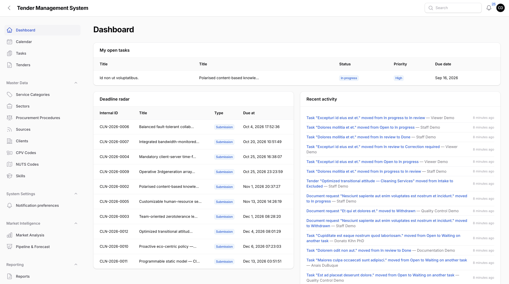
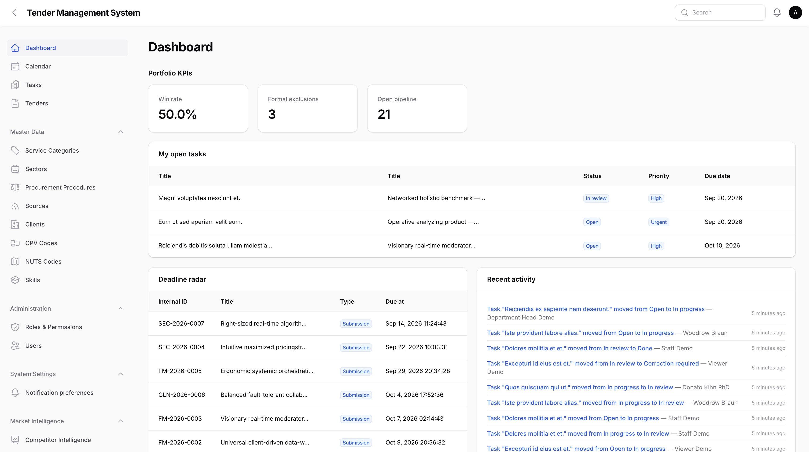
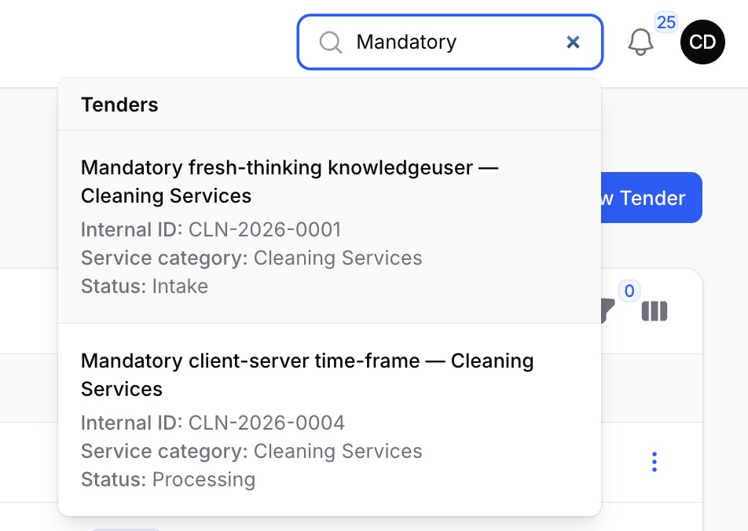
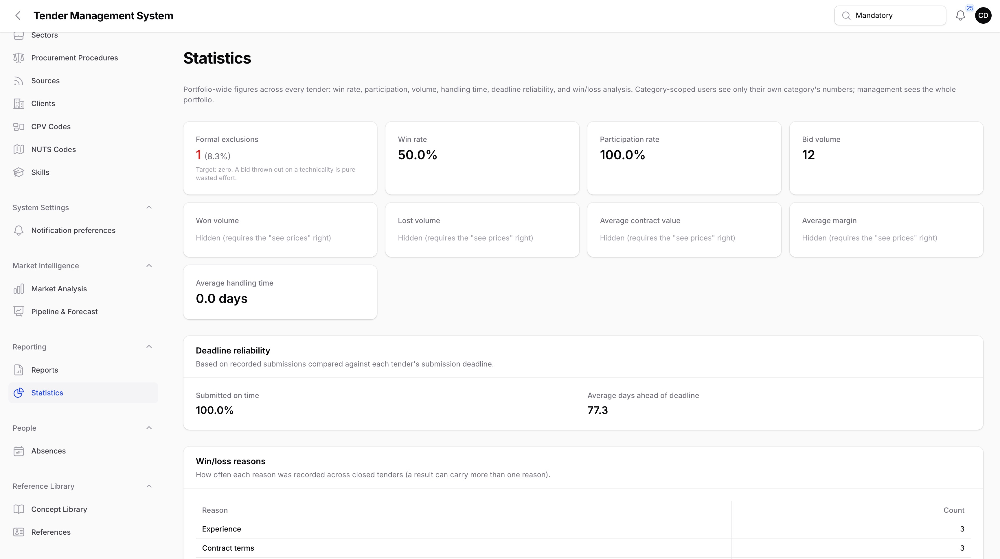
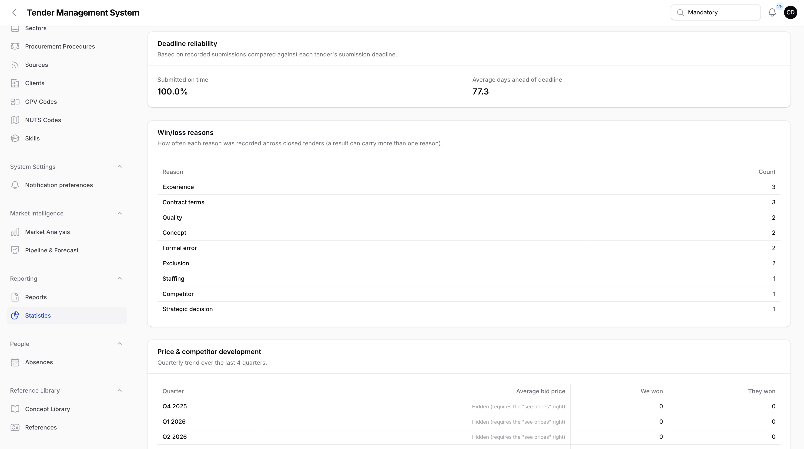
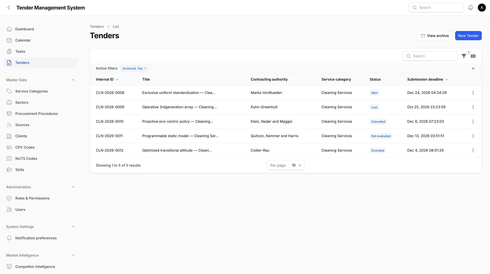
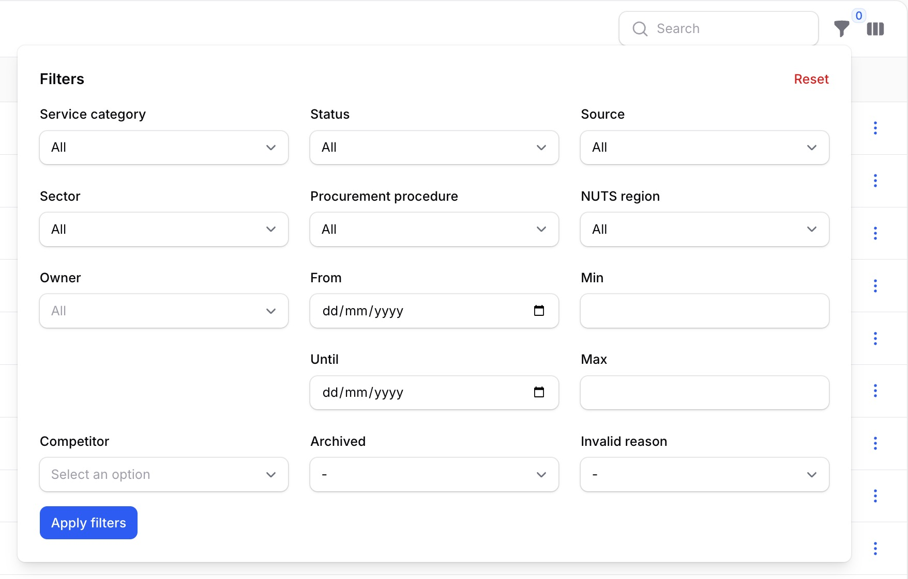
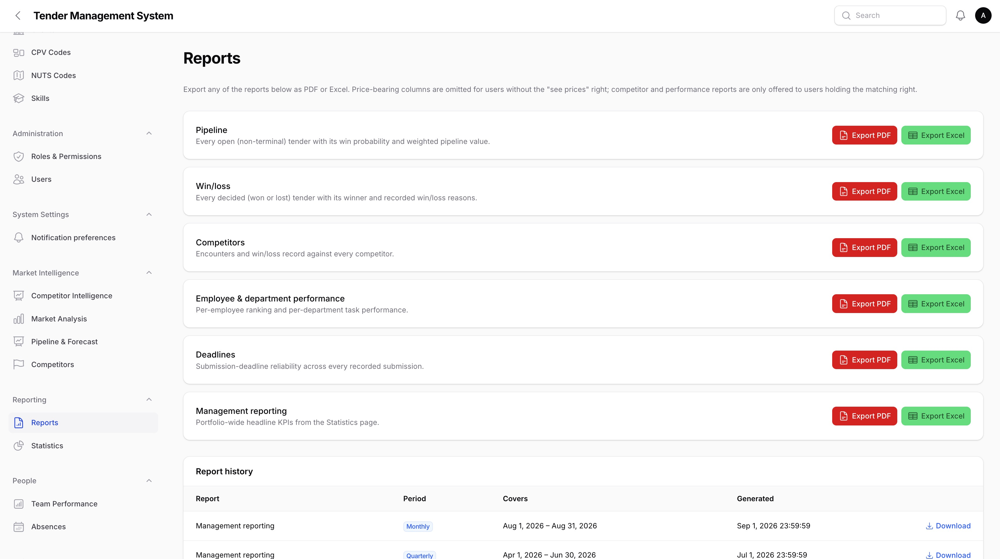
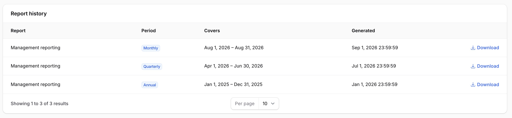

# Dashboards, Search, Statistics, Archive & Reporting

_Last updated: 04/09/2026_

This page covers the portfolio-wide views TMS provides on top of individual tenders: the home dashboard, global search, the Statistics page, the Archive, and the Reports page, including automatically generated periodic reports.

## Dashboard

Logging in takes you to the **Dashboard**, a single page whose widgets adjust to who you are. There's no separate employee, team lead, or management dashboard to navigate between, everyone lands on the same page, and each widget simply shows or hides itself based on your role and rights.

*The Dashboard's employee-facing widgets: open tasks, deadline radar, and recent activity.*

- **My open tasks** lists your own not-yet-done tasks, soonest due date first. Visible to everyone.
- **Deadline radar** lists every upcoming tender deadline you can see, soonest first, respecting the same category scoping as everywhere else. This is a quick-glance list, not the full calendar, see [Managing tenders](03-managing-tenders.md#the-tender-calendar) for that.
- **Recent activity** is a combined, reverse-chronological feed of task status changes, tender status changes, and document request status changes, each entry linking back to its tender. Visible to everyone.

*The Dashboard's team lead and management widgets.*

- **My department** shows a quick open task / overdue task / on-time rate snapshot for your own department. It appears for team leads and department heads who have a department set.
- **Portfolio KPIs** shows win rate, formal exclusion count, and open pipeline count across the whole portfolio. It appears only for holders of the "view employee statistics" right, described in [Administration](08-administration.md).

## Global search

The search box in the top navigation bar searches across tenders, clients, competitors, and employees at once, respecting each result type's usual scoping and rights.

*Global search results spanning tenders and clients.*

A tender can be found by its internal ID, procurement number, title, city, procurement office, client name, service type, owner name, a document's filename, the recorded winner, or a competitor's name. Clients are found by name, competitors by name (if you hold the "see competitor data" right), and employees by name or email (if you can manage users). A category-scoped user's search only ever returns tenders from their own category, the same as every list page in TMS.

## Statistics

The **Statistics** page, in the new **Reporting** navigation section, gives a portfolio-wide read on how tenders are performing.

*The Statistics page's headline KPI cards.*

- **Formal exclusions**, a count and rate, is shown first and separately from the rest, the target here is always zero, since a bid thrown out on a technicality is pure wasted effort.
- **Win rate** and **participation rate** are shown as percentages.
- **Bid volume**, **won volume**, **lost volume**, **average contract value**, and **average margin** are shown alongside a count where relevant. The volume, value, and margin figures require the "see prices" right, without it they show as hidden rather than being left off the page entirely.
- **Average handling time** is the average number of days between a tender being created and it reaching a closed status.

*Deadline reliability and win/loss reason breakdown.*

- **Deadline reliability** compares recorded submissions against each tender's submission deadline, showing the share submitted on time and the average number of days ahead of deadline (a negative number means submissions are typically late).
- **Win/loss reasons** tallies how often each reason from the Result record, see [Result & Lessons Learned](14-result-lessons-learned.md), was recorded across every closed tender.
- **Price & competitor development** is a quarterly trend over the last 4 quarters, average bid price alongside how many tenders were won versus lost to a named competitor.

A category-scoped user sees only their own category's numbers throughout this page. A management user with no category set sees the whole portfolio combined, the same convention used everywhere else in TMS.

## Archive

Tenders are never deleted, only archived, see [Administration](08-administration.md#removing-a-genuine-junk-entry) for the separate, admin-only hard-delete safeguard. Archiving hides a tender from the everyday tender list without losing anything about it.

An archived tender keeps its own lifecycle status visible alongside the archive flag, so an archived tender you can see still shows whether it was won, lost, or something else. Reach the archive from the **View archive** button on the main tender list.

*The Archive list.*

## Combinable tender filters

The main tender list, and the Archive above, both offer the same set of filters, so you filter the same way in either place: service category, status, source, sector, procurement procedure, region, employee, a date-range period filter, an estimated contract volume range, and competitor. These can be combined freely, for example service category and status together, to narrow down to exactly the tenders you're looking for.

*The combinable tender filters panel.*

## Reports

The **Reports** page, also under **Reporting**, offers six report types as PDF or Excel exports: pipeline, win/loss, competitors, employee & department performance, deadlines, and management reporting.

*The Reports page's report types and export buttons.*

- **Competitors** and **employee & department performance** are only offered to users holding the matching right ("see competitor data" and "view employee statistics"), the same rights that already gate their interactive source pages.
- Every export omits price-bearing columns for a user without the "see prices" right, checked again at export time, not just on what's visible on screen.

### Automatic scheduled reports

A monthly, quarterly, and yearly management-reporting PDF is generated automatically, each covering the period that just closed (last month, last quarter, or last year), with every KPI computed from that period's own data rather than the portfolio's all-time figures. Once generated, every super admin and department head is notified, with a link to download it.

*The Reports page's Report history table.*

Past reports are also listed on the Reports page itself, in a **Report history** table, visible only to holders of the "view employee statistics" right, the same right that gates the download link. Clicking download streams the stored PDF.

## Where to go next

- [Administration](08-administration.md), covering the "see prices", "see competitor data", and "view employee statistics" rights, and hard-delete.
- [People, Teams & Cover](16-people-teams-cover.md), covering the Team Performance page the employee & department performance report reuses.
- [Competitors, Market Intelligence, Client History & Pipeline](15-competitors-market-intelligence.md), covering the Competitor Intelligence and Pipeline & Forecast pages the competitors and pipeline reports reuse.
